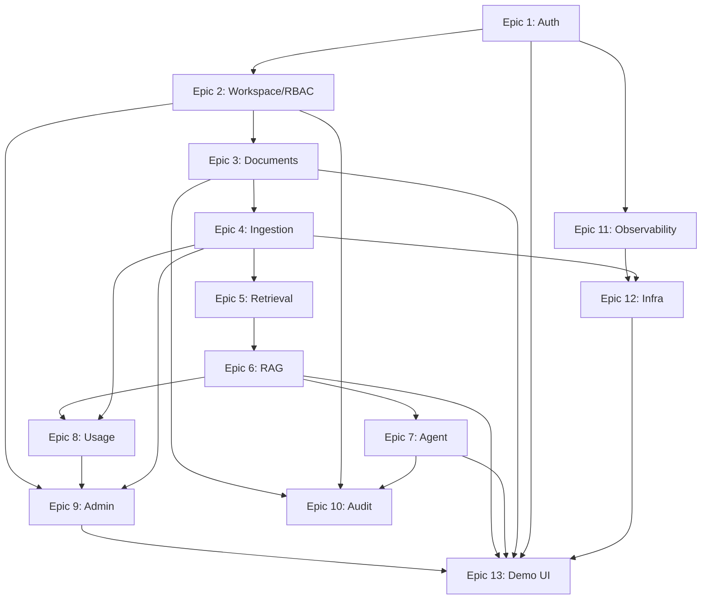

# AtlasOps AI — MVP Product Backlog

> Implementation-ready product backlog derived from the AtlasOps AI PRD.  
> Scope: MVP only. No V2, integrations, or speculative roadmap items.

**Individual stories:** Each user story is also available as a separate file in [`stories/`](./stories/README.md).

---

## 1. MVP Product Summary

**AtlasOps AI** is a multi-tenant AI knowledge assistant for engineering teams. Users create workspaces, upload technical documents (runbooks, incident reports, architecture notes), and the system indexes them via embeddings and vector search. Engineers ask natural-language questions and receive **grounded answers with citations**. An **incident investigation agent** uses safe internal tools to search the knowledge base, summarize documents, compare incidents, and suggest debugging steps — without performing external actions.

The MVP proves the core product loop:

> **Workspace → upload → ingest → retrieve → cited answer → agent investigation → usage visibility**

It demonstrates production-style backend architecture: authentication, RBAC, workspace isolation, background ingestion, token/cost tracking, audit logs, observability, and local/cloud deployment readiness.

**Success bar:** A portfolio-ready demo where a user can register, create a workspace, upload Northstar Cloud demo documents, ask an incident question, receive cited answers, run an agent investigation, and review ingestion status and token usage — with no cross-workspace data leakage.

---

## 2. MVP Assumptions

| # | Assumption |
|---|------------|
| A1 | Email + password authentication is sufficient; no SSO or magic link in MVP. |
| A2 | Single LLM provider (OpenAI or Anthropic) for answer generation; one embedding model. |
| A3 | PostgreSQL + pgvector is the vector store; no dedicated vector DB in MVP. |
| A4 | File storage is local filesystem or S3-compatible object storage; abstracted behind an interface. |
| A5 | Background jobs run via Redis + Celery (or RQ); one ingestion worker is enough for MVP. |
| A6 | Frontend is minimal (Next.js or API-first with Swagger); polish is secondary to backend credibility. |
| A7 | Demo dataset ("Northstar Cloud") is seeded for portfolio demos; not required for every environment. |
| A8 | API rate limiting is basic (per-user/per-workspace); no billing or quota enforcement. |
| A9 | Answers are non-streaming; full response returned in one API call. |
| A10 | Agent tools are read-only and workspace-scoped; no external API calls beyond LLM/embedding providers. |
| A11 | Top-k retrieval defaults to 8 chunks, compressed to 4–5 for context window. |
| A12 | Chunk size: 800–1,200 tokens; overlap: 100–200 tokens. |

---

## 3. MVP User Personas

### Workspace Owner
Creates the workspace, invites members, assigns roles, views usage summaries, and owns workspace lifecycle decisions.

### Admin
Uploads and manages documents, triggers re-indexing, monitors ingestion jobs, reviews failed jobs and audit logs.

### Engineer
Asks RAG questions, continues conversations, starts incident agent investigations, and validates answers via citations.

### Viewer
Can ask questions and view answers/conversations; cannot upload, delete, re-index documents, or manage members.

---

## 4. MVP Epics

| Epic | ID Prefix | Description |
|------|-----------|-------------|
| 1. Authentication and User Accounts | AUTH | Register, login, logout, JWT, password security |
| 2. Workspace Management and RBAC | WS | Workspaces, membership, roles, permission enforcement |
| 3. Document Upload and Management | DOC | Upload, list, view, delete, re-index, status |
| 4. Ingestion Pipeline | ING | Extract, chunk, embed, store, job tracking, retry |
| 5. Vector Search and Retrieval | RET | Query embedding, workspace-scoped search, metadata filters |
| 6. RAG Question Answering | RAG | Grounded answers, citations, conversations, insufficient-context handling |
| 7. AI Agent Incident Investigation | AGENT | Agent runs, safe tools, structured output, tool call logging |
| 8. Usage Tracking and Cost Visibility | USAGE | LLM/embedding event logging, cost estimates, summaries |
| 9. Admin Dashboard | ADMIN | Documents, jobs, questions, usage, audit log views |
| 10. Audit Logs and Security Events | AUDIT | Sensitive action logging, authorization failure events |
| 11. Observability and Reliability | OBS | Health checks, structured logs, request IDs, error format |
| 12. Deployment and Developer Experience | INFRA | Docker Compose, migrations, CI, Terraform scaffold, docs |
| 13. Minimal Demo UI | UI | Next.js app shell, auth pages, documents, Q&A, agent, admin dashboard |

---

## 5. User Stories by Epic

---

### Epic 1: Authentication and User Accounts

---

#### AUTH-001 — User Registration

**User Story**

> As a new user, I want to register with email and password, so that I can access AtlasOps AI.

**Product Rationale**

Registration is the entry point to the product loop. Without accounts, workspace isolation and RBAC cannot exist.

**Functional Requirements**

- `POST /auth/register` accepts `email`, `password`, optional `name`
- Email must be unique and valid format
- Password minimum length enforced (e.g., 8 characters)
- Password stored as bcrypt/argon2 hash; never plaintext
- Returns user object (no password) and JWT on success
- Duplicate email returns 409 Conflict

**Acceptance Criteria**

- Given a valid email and password  
  When I submit registration  
  Then a user record is created and I receive a JWT access token

- Given an email already registered  
  When I submit registration  
  Then the API returns 409 with a clear error message

- Given a password below minimum length  
  When I submit registration  
  Then the API returns 422 with validation details

**Priority:** P0  
**Dependencies:** None  
**Notes for Engineering:** Use Pydantic validation; consider email normalization (lowercase). JWT expiry configurable via env.

---

#### AUTH-002 — User Login

**User Story**

> As a registered user, I want to log in with email and password, so that I can access my workspaces and data.

**Product Rationale**

Login enables returning users to resume work and attaches identity to all subsequent API calls.

**Functional Requirements**

- `POST /auth/login` accepts `email`, `password`
- Validates credentials against hashed password
- Returns JWT access token and token expiry
- Invalid credentials return 401 without revealing whether email exists

**Acceptance Criteria**

- Given valid credentials  
  When I log in  
  Then I receive a JWT and can call authenticated endpoints

- Given invalid password  
  When I log in  
  Then the API returns 401 Unauthorized

**Priority:** P0  
**Dependencies:** AUTH-001  
**Notes for Engineering:** Rate-limit login attempts per IP/email to reduce brute-force risk.

---

#### AUTH-003 — User Logout

**User Story**

> As an authenticated user, I want to log out, so that my session token is invalidated on shared devices.

**Product Rationale**

Basic session hygiene for portfolio credibility; even with stateless JWT, logout documents intent.

**Functional Requirements**

- `POST /auth/logout` requires valid JWT
- Client-side token discard is primary mechanism
- Optional: token blocklist in Redis for MVP if feasible; otherwise document client-side logout

**Acceptance Criteria**

- Given I am authenticated  
  When I call logout  
  Then the API returns 204 and subsequent requests with the same token are rejected if blocklist is implemented

- Given blocklist is not implemented  
  When I log out  
  Then the API confirms logout and documentation states client must discard token

**Priority:** P1  
**Dependencies:** AUTH-002  
**Notes for Engineering:** Stateless JWT logout is acceptable for MVP if documented; blocklist is P1 polish.

---

#### AUTH-004 — Current User Endpoint

**User Story**

> As an authenticated user, I want to retrieve my profile, so that the UI can display my identity and permissions context.

**Product Rationale**

Required for frontend session bootstrap and debugging auth issues.

**Functional Requirements**

- `GET /auth/me` returns `id`, `email`, `name`, `created_at`
- Requires valid JWT in `Authorization: Bearer` header
- Does not return password hash or internal fields

**Acceptance Criteria**

- Given a valid JWT  
  When I call `/auth/me`  
  Then I receive my user profile

- Given an expired or missing token  
  When I call `/auth/me`  
  Then the API returns 401

**Priority:** P0  
**Dependencies:** AUTH-002  
**Notes for Engineering:** Attach user to request context via dependency injection middleware.

---

#### AUTH-005 — JWT Authentication Middleware

**User Story**

> As the system, I want to validate JWTs on protected routes, so that only authenticated users access workspace data.

**Product Rationale**

Central auth middleware is the foundation for RBAC and workspace isolation.

**Functional Requirements**

- Middleware extracts Bearer token, validates signature and expiry
- Injects `current_user` into request context
- Unauthenticated requests to protected routes return 401
- Malformed tokens return 401 with structured error

**Acceptance Criteria**

- Given no Authorization header  
  When I call a protected endpoint  
  Then the API returns 401

- Given an expired JWT  
  When I call a protected endpoint  
  Then the API returns 401 with `token_expired` error code

**Priority:** P0  
**Dependencies:** AUTH-002  
**Notes for Engineering:** Use FastAPI `Depends`; secret key from env; algorithm HS256 or RS256.

---

#### AUTH-006 — Auth Error Responses

**User Story**

> As a developer integrating the API, I want consistent auth error responses, so that I can handle failures predictably.

**Product Rationale**

Structured errors reduce integration friction and demonstrate API maturity.

**Functional Requirements**

- Auth errors use consistent JSON shape: `{ "error": { "code", "message", "details" } }`
- Codes include: `invalid_credentials`, `token_expired`, `token_invalid`, `unauthorized`
- HTTP status codes match semantics (401, 403, 409, 422)

**Acceptance Criteria**

- Given any auth failure  
  When the API responds  
  Then the body includes `error.code` and `error.message`

**Priority:** P1  
**Dependencies:** AUTH-005  
**Notes for Engineering:** Share error schema across all API modules (OBS-005).

---

---

### Epic 2: Workspace Management and RBAC

---

#### WS-001 — Create Workspace

**User Story**

> As a new user, I want to create a workspace, so that my team has an isolated knowledge container.

**Product Rationale**

Workspaces are the tenancy boundary for all documents, chunks, conversations, and usage.

**Functional Requirements**

- `POST /workspaces` accepts `name`, optional `slug`
- Creator is assigned `Owner` role automatically
- Slug auto-generated from name if omitted; must be unique
- Returns workspace with `id`, `name`, `slug`, `created_at`

**Acceptance Criteria**

- Given I am authenticated  
  When I create a workspace named "Northstar Cloud"  
  Then a workspace is created and I am its Owner

- Given a duplicate slug  
  When I create a workspace  
  Then the API returns 409

**Priority:** P0  
**Dependencies:** AUTH-005  
**Notes for Engineering:** Slug used in URLs; validate slug format (lowercase, hyphens).

---

#### WS-002 — List and Get Workspaces

**User Story**

> As a user, I want to list workspaces I belong to, so that I can switch between teams.

**Product Rationale**

Multi-workspace membership is core to the data model; users need discovery and selection.

**Functional Requirements**

- `GET /workspaces` returns workspaces where user is a member, including role
- `GET /workspaces/{workspace_id}` returns workspace details if member
- Non-members receive 403

**Acceptance Criteria**

- Given I belong to Workspace A and B  
  When I list workspaces  
  Then both appear with my role

- Given I am not a member of Workspace C  
  When I request Workspace C  
  Then the API returns 403

**Priority:** P0  
**Dependencies:** WS-001  
**Notes for Engineering:** Include member count optionally; paginate if list grows.

---

#### WS-003 — Invite and Manage Members

**User Story**

> As a Workspace Owner, I want to add members to my workspace, so that my team can collaborate.

**Product Rationale**

Collaboration requires membership management; Owner/Admin must control access.

**Functional Requirements**

- `POST /workspaces/{workspace_id}/members` accepts `email`, `role`
- Only Owner and Admin can add members
- Valid roles: `owner`, `admin`, `member`, `viewer`
- User must exist (registered) or return 404 for unknown email
- Cannot demote/remove last Owner

**Acceptance Criteria**

- Given I am Workspace Owner  
  When I invite `engineer@example.com` as Member  
  Then they appear in workspace members

- Given I am a Viewer  
  When I try to add a member  
  Then the API returns 403

**Priority:** P0  
**Dependencies:** WS-001, AUTH-001  
**Notes for Engineering:** `PATCH`/`DELETE` for role change and removal in same story scope or WS-004.

---

#### WS-004 — Change Member Roles and Remove Members

**User Story**

> As a Workspace Owner, I want to change member roles or remove members, so that I can enforce least privilege.

**Product Rationale**

RBAC is incomplete without role updates and removal; required for security demos.

**Functional Requirements**

- `PATCH /workspaces/{workspace_id}/members/{user_id}` updates role
- `DELETE /workspaces/{workspace_id}/members/{user_id}` removes member
- Only Owner can assign Owner role; Admin cannot modify Owner
- Removing self allowed unless last Owner

**Acceptance Criteria**

- Given I am Owner  
  When I change a Member to Viewer  
  Then their permissions update immediately

- Given only one Owner remains  
  When Owner tries to remove themselves  
  Then the API returns 400 with clear message

**Priority:** P0  
**Dependencies:** WS-003  
**Notes for Engineering:** Emit audit event (AUDIT-005).

---

#### WS-005 — Role-Based Permission Matrix

**User Story**

> As the system, I want to enforce role permissions on every protected action, so that Viewers cannot mutate documents.

**Product Rationale**

Permission enforcement is mandatory for multi-tenant trust and portfolio security narrative.

**Functional Requirements**

Permission matrix (minimum):

| Action | Owner | Admin | Member | Viewer |
|--------|-------|-------|--------|--------|
| Upload/delete/reindex docs | ✓ | ✓ | ✓ | ✗ |
| Ask questions / agent runs | ✓ | ✓ | ✓ | ✓ |
| Manage members | ✓ | ✓ | ✗ | ✗ |
| View admin dashboard | ✓ | ✓ | ✗ | ✗ |
| Delete workspace | ✓ | ✗ | ✗ | ✗ |

- Permission checks in service layer, not only routes
- Violations return 403 and log audit event

**Acceptance Criteria**

- Given I am a Viewer  
  When I upload a document  
  Then the API returns 403

- Given I am a Member  
  When I ask a question  
  Then the request succeeds

**Priority:** P0  
**Dependencies:** WS-003  
**Notes for Engineering:** Centralize in `PermissionService` or decorator; unit test matrix.

---

#### WS-006 — Active Workspace Context

**User Story**

> As a user, I want all API calls scoped to a workspace, so that my queries only access that workspace's data.

**Product Rationale**

Explicit workspace scoping prevents accidental cross-tenant access in URL design.

**Functional Requirements**

- All resource routes under `/workspaces/{workspace_id}/...`
- Middleware verifies user membership before handler execution
- `workspace_id` injected into service/repository layer for all queries

**Acceptance Criteria**

- Given I belong to Workspace A  
  When I ask a question in Workspace A  
  Then retrieval only searches Workspace A documents

- Given I do not belong to Workspace B  
  When I request any Workspace B resource  
  Then the API returns 403

**Priority:** P0  
**Dependencies:** WS-002, WS-005  
**Notes for Engineering:** Every DB query must include `workspace_id` filter; add integration tests for isolation.

---

#### WS-007 — Workspace-Scoped Data Access Layer

**User Story**

> As an engineer implementing features, I want repositories to require workspace_id, so that cross-workspace leakage is structurally difficult.

**Product Rationale**

Defense in depth for the highest-risk MVP requirement: tenant isolation.

**Functional Requirements**

- Repository methods require `workspace_id` parameter
- No global document/chunk/conversation queries without workspace filter
- Integration test suite verifies isolation across documents, chunks, conversations, agent runs

**Acceptance Criteria**

- Given documents in Workspace A and B  
  When retrieval runs in Workspace A  
  Then no chunks from Workspace B are returned

- Given a direct chunk ID from another workspace  
  When accessed via API  
  Then the API returns 404 or 403

**Priority:** P0  
**Dependencies:** WS-006  
**Notes for Engineering:** Consider DB row-level policies as optional hardening; not required for MVP.

---

---

### Epic 3: Document Upload and Management

---

#### DOC-001 — Upload Supported Documents

**User Story**

> As an Admin, I want to upload engineering documents, so that AtlasOps can index my team's knowledge.

**Product Rationale**

Upload is the first step in the core product loop; without documents, RAG and agents have nothing to retrieve.

**Functional Requirements**

- `POST /workspaces/{workspace_id}/documents` multipart upload
- Supported types: `.md`, `.txt`, `.pdf`, `.json`
- Max file size configurable (e.g., 10 MB MVP default)
- Stores file to object storage; creates document record with status `uploaded`
- Fields: `title` (default filename), `source_type`, `file_type`, `uploaded_by`, `workspace_id`
- Triggers ingestion job creation (ING-001)
- Requires Admin, Member, or higher (not Viewer)

**Acceptance Criteria**

- Given I upload `billing-api-runbook.md`  
  When upload completes  
  Then document is saved with status `uploaded` and assigned to my workspace

- Given I upload an unsupported `.exe` file  
  When upload completes  
  Then the API returns 422 with unsupported file type error

**Priority:** P0  
**Dependencies:** WS-005, WS-006  
**Notes for Engineering:** Validate MIME type and extension; virus scan out of scope.

---

#### DOC-002 — File Type Validation

**User Story**

> As the system, I want to reject unsupported file types at upload, so that ingestion failures are prevented early.

**Product Rationale**

Fail fast at upload reduces wasted worker cycles and clearer user feedback.

**Functional Requirements**

- Whitelist extensions: md, txt, pdf, json
- Reject empty files
- Return validation error with allowed types list

**Acceptance Criteria**

- Given a `.docx` file  
  When I attempt upload  
  Then the API returns 422 before storage

**Priority:** P0  
**Dependencies:** DOC-001  
**Notes for Engineering:** PDF validation can check magic bytes `%PDF`.

---

#### DOC-003 — List Documents

**User Story**

> As a workspace member, I want to list documents in my workspace, so that I can see what knowledge is indexed.

**Product Rationale**

Users need visibility into indexed corpus; admin dashboard depends on this.

**Functional Requirements**

- `GET /workspaces/{workspace_id}/documents` with pagination
- Returns `id`, `title`, `file_type`, `status`, `uploaded_by`, `created_at`, `updated_at`
- Filter by status optional
- All roles including Viewer can list

**Acceptance Criteria**

- Given 5 documents in my workspace  
  When I list documents  
  Then I see all 5 with current status

- Given pagination limit=2  
  When I request page 2  
  Then I receive the next 2 documents

**Priority:** P0  
**Dependencies:** DOC-001  
**Notes for Engineering:** Index on `(workspace_id, created_at)`.

---

#### DOC-004 — View Document Details

**User Story**

> As an engineer, I want to view document details including status and error messages, so that I know if indexing succeeded.

**Product Rationale**

Transparency into ingestion state builds trust during demos and debugging.

**Functional Requirements**

- `GET /workspaces/{workspace_id}/documents/{document_id}`
- Returns metadata, status, chunk count (if indexed), `error_message` if failed, ingestion job reference
- Workspace-scoped; 404 if wrong workspace

**Acceptance Criteria**

- Given a failed document  
  When I view details  
  Then I see status `failed` and `error_message`

- Given an indexed document  
  When I view details  
  Then I see chunk count > 0

**Priority:** P0  
**Dependencies:** DOC-001, ING-007  
**Notes for Engineering:** Do not expose raw storage path to clients.

---

#### DOC-005 — Delete Document

**User Story**

> As an Admin, I want to delete a document, so that outdated or incorrect knowledge is removed.

**Product Rationale**

Corpus hygiene; deletion must cascade chunks and embeddings.

**Functional Requirements**

- `DELETE /workspaces/{workspace_id}/documents/{document_id}`
- Requires Admin, Member, or Owner (not Viewer)
- Deletes file from storage, chunks, embeddings, and document record
- Emits audit event (AUDIT-002)
- Returns 204

**Acceptance Criteria**

- Given an indexed document  
  When I delete it  
  Then document and all chunks are removed and no longer appear in search

- Given a Viewer  
  When they attempt delete  
  Then the API returns 403

**Priority:** P0  
**Dependencies:** DOC-001, ING-006, WS-005  
**Notes for Engineering:** Use transaction or compensating delete; soft-delete optional P2.

---

#### DOC-006 — Re-index Document

**User Story**

> As an Admin, I want to re-index a document, so that updated extraction or embedding models are applied.

**Product Rationale**

Re-index proves pipeline idempotency and supports demo recovery after failures.

**Functional Requirements**

- `POST /workspaces/{workspace_id}/documents/{document_id}/reindex`
- Deletes existing chunks for document, resets status to `processing`, enqueues new ingestion job
- Emits audit event (AUDIT-003)
- Requires upload permissions (not Viewer)

**Acceptance Criteria**

- Given an indexed document  
  When I trigger re-index  
  Then old chunks are replaced and status transitions to `indexed` on success

**Priority:** P1  
**Dependencies:** DOC-001, ING-001  
**Notes for Engineering:** Prevent concurrent re-index jobs for same document.

---

#### DOC-007 — Document Status Display

**User Story**

> As a user, I want clear document status values, so that I understand ingestion progress.

**Product Rationale**

Status enum is the user-facing contract for async processing.

**Functional Requirements**

- Status values: `uploaded`, `processing`, `indexed`, `failed`
- Status transitions driven by ingestion worker
- UI/API exposes human-readable status labels

**Acceptance Criteria**

- Given upload completes  
  When ingestion starts  
  Then status becomes `processing`

- Given ingestion succeeds  
  When worker completes  
  Then status becomes `indexed`

**Priority:** P0  
**Dependencies:** ING-001  
**Notes for Engineering:** Document state machine in code comments or enum.

---

---

### Epic 4: Ingestion Pipeline

---

#### ING-001 — Create Ingestion Job on Upload

**User Story**

> As the system, I want to enqueue an ingestion job when a document is uploaded, so that processing happens asynchronously.

**Product Rationale**

Background processing is a production requirement; synchronous ingestion blocks API and fails at scale.

**Functional Requirements**

- On document upload, create `ingestion_jobs` record with status `pending`
- Enqueue Celery/RQ task with `document_id`, `workspace_id`
- Update document status to `processing` when worker picks up job

**Acceptance Criteria**

- Given a successful upload  
  When the API responds  
  Then an ingestion job exists with status `pending` or `processing`

**Priority:** P0  
**Dependencies:** DOC-001  
**Notes for Engineering:** Job payload must include workspace_id for isolation checks in worker.

---

#### ING-002 — Extract Text from Documents

**User Story**

> As the system, I want to extract plain text from uploaded files, so that content can be chunked and embedded.

**Product Rationale**

Text extraction is the bridge between raw files and the RAG pipeline.

**Functional Requirements**

- Markdown/TXT: read as UTF-8 text
- JSON: extract text fields or stringify structured content
- PDF: extract text per page with page numbers in metadata
- Extraction failures mark job `failed` with reason

**Acceptance Criteria**

- Given a valid PDF with 3 pages  
  When extraction runs  
  Then text is extracted with page metadata

- Given a corrupted PDF  
  When extraction runs  
  Then job status is `failed` with error reason stored

**Priority:** P0  
**Dependencies:** ING-001  
**Notes for Engineering:** Use `pypdf` or `pdfplumber`; handle empty extraction as failure.

---

#### ING-003 — Chunk Document Content

**User Story**

> As the system, I want to split extracted text into overlapping chunks, so that retrieval can find relevant passages.

**Product Rationale**

Chunk quality directly affects RAG answer quality; core pipeline step.

**Functional Requirements**

- Chunk size: 800–1,200 tokens (configurable)
- Overlap: 100–200 tokens
- Preserve metadata: document title, section heading (if detectable), page number (PDF), source type, workspace_id, document_id, chunk_index
- Token counting via same tokenizer as embedding model approximation

**Acceptance Criteria**

- Given a 5,000-token document  
  When chunking runs  
  Then multiple chunks are created with sequential `chunk_index` and overlap

- Given metadata from PDF page 2  
  When chunk is stored  
  Then metadata includes `page_number: 2`

**Priority:** P0  
**Dependencies:** ING-002  
**Notes for Engineering:** Split on paragraph boundaries where possible before hard token cut.

---

#### ING-004 — Generate Embeddings for Chunks

**User Story**

> As the system, I want to generate vector embeddings for each chunk, so that semantic search works.

**Product Rationale**

Embeddings enable vector retrieval; must log usage (USAGE-002).

**Functional Requirements**

- Call embedding provider for each chunk (batch if supported)
- Store vector in pgvector column
- Record embedding model name on chunk or job
- Track embedding token usage per batch

**Acceptance Criteria**

- Given 10 chunks  
  When embedding generation completes  
  Then each chunk has a non-null embedding vector

- Given embedding API failure  
  When retry exhausts  
  Then job is marked failed with reason

**Priority:** P0  
**Dependencies:** ING-003, USAGE-002  
**Notes for Engineering:** Batch size configurable; abstract `EmbeddingProvider` interface.

---

#### ING-005 — Store Chunks in Vector Database

**User Story**

> As the system, I want to persist chunks with embeddings in PostgreSQL/pgvector, so that retrieval can query them.

**Product Rationale**

Durable chunk storage is required for all downstream RAG and agent tools.

**Functional Requirements**

- Insert into `document_chunks` with workspace_id, document_id, content, embedding, metadata, token_count
- Index on workspace_id and document_id
- pgvector index for similarity search (IVFFlat or HNSW per pgvector version)

**Acceptance Criteria**

- Given successful embedding  
  When storage completes  
  Then chunks are queryable via vector search in the same workspace

**Priority:** P0  
**Dependencies:** ING-004  
**Notes for Engineering:** Migration creates vector extension and index; document re-index deletes old chunks first.

---

#### ING-006 — Track Ingestion Job Status

**User Story**

> As an Admin, I want to see ingestion job status, so that I know when documents are ready for questions.

**Product Rationale**

Job visibility is essential for async UX and admin dashboard.

**Functional Requirements**

- Job statuses: `pending`, `processing`, `completed`, `failed`
- Fields: `document_id`, `workspace_id`, `started_at`, `completed_at`, `error_message`, `retry_count`
- `GET` via admin endpoint or document detail
- On success: document status → `indexed`; job → `completed`

**Acceptance Criteria**

- Given ingestion in progress  
  When Admin views job status  
  Then status is `processing`

- Given ingestion completes  
  When Admin views job status  
  Then status is `completed` and document is `indexed`

**Priority:** P0  
**Dependencies:** ING-001  
**Notes for Engineering:** Expose via ADMIN-002.

---

#### ING-007 — Retry Failed Ingestion Jobs

**User Story**

> As an Admin, I want failed ingestion jobs to be retryable, so that transient failures do not permanently block indexing.

**Product Rationale**

Retry logic demonstrates production reliability awareness.

**Functional Requirements**

- Automatic retry up to N times (e.g., 3) with exponential backoff for transient errors
- Manual retry via re-index endpoint (DOC-006) or admin action
- Store failure reason on job and document `error_message`
- Permanent failures (unsupported content, empty text) do not infinite-retry

**Acceptance Criteria**

- Given a transient embedding API timeout  
  When worker retries  
  Then job succeeds on retry and status becomes `completed`

- Given empty extracted text  
  When worker fails  
  Then job is `failed` with reason "no extractable text" and no further auto-retry

**Priority:** P1  
**Dependencies:** ING-006  
**Notes for Engineering:** Classify errors as retryable vs permanent.

---

---

### Epic 5: Vector Search and Retrieval

---

#### RET-001 — Generate Query Embedding

**User Story**

> As the system, I want to embed user questions, so that I can perform semantic similarity search.

**Product Rationale**

Query embedding is the first step of every RAG and agent search operation.

**Functional Requirements**

- Embed question text using same model as document chunks
- Log embedding usage event
- Handle empty query rejection at validation layer

**Acceptance Criteria**

- Given a valid question  
  When retrieval starts  
  Then a query embedding vector is generated

**Priority:** P0  
**Dependencies:** ING-004, USAGE-002  
**Notes for Engineering:** Cache query embeddings within same request only; cross-request cache P2.

---

#### RET-002 — Workspace-Scoped Vector Search

**User Story**

> As an engineer, I want search results limited to my workspace, so that I never see another team's documents.

**Product Rationale**

Non-negotiable security requirement; must be tested explicitly.

**Functional Requirements**

- Similarity search filtered by `workspace_id`
- Cosine similarity or L2 per pgvector config
- Return top-k results (default k=8)

**Acceptance Criteria**

- Given I belong to Workspace A  
  When I ask a question in Workspace A  
  Then retrieval only searches documents belonging to Workspace A

- Given identical content in Workspace A and B  
  When User A searches  
  Then only Workspace A chunks appear

**Priority:** P0  
**Dependencies:** ING-005, WS-007  
**Notes for Engineering:** SQL must include `WHERE workspace_id = :id`; never rely on post-filter.

---

#### RET-003 — Top-K Retrieval with Scores

**User Story**

> As the system, I want to return top-k chunks with similarity scores, so that downstream RAG can rank and cite sources.

**Product Rationale**

Scores enable confidence heuristics and citation ordering.

**Functional Requirements**

- Return chunk id, content preview, score, document metadata, citation_id
- Default k=8; compress to top 4–5 for LLM context in RAG layer
- Minimum score threshold optional; below threshold triggers insufficient-context path

**Acceptance Criteria**

- Given indexed documents  
  When I search with a relevant query  
  Then I receive up to 8 chunks ordered by descending score

- Given no chunks above threshold  
  When search completes  
  Then empty or low-score result set is flagged to RAG layer

**Priority:** P0  
**Dependencies:** RET-002  
**Notes for Engineering:** `citation_id` stable for UI linking; can be chunk UUID.

---

#### RET-004 — Metadata Filtering

**User Story**

> As an engineer, I want to filter retrieval by document type or source, so that answers focus on runbooks or incidents.

**Product Rationale**

Metadata filters improve precision for agent tools and power-user queries.

**Functional Requirements**

- Optional filters: `file_type`, `source_type`, `document_id`
- Filters applied in SQL alongside workspace_id
- Agent search tool accepts filter parameters

**Acceptance Criteria**

- Given filter `file_type=pdf`  
  When search runs  
  Then only PDF document chunks are returned

**Priority:** P1  
**Dependencies:** RET-002  
**Notes for Engineering:** Index filter columns; validate filter values.

---

#### RET-005 — Source Chunk Preview

**User Story**

> As an engineer, I want retrieved chunks to include previews and document titles, so that citations are understandable.

**Product Rationale**

Citations must be human-readable for trust and verification.

**Functional Requirements**

- Each result includes document title, chunk text (or truncated preview), metadata (section, page)
- Preview max length configurable (e.g., 500 chars)

**Acceptance Criteria**

- Given a retrieved chunk  
  When included in API response  
  Then response includes document title and chunk preview text

**Priority:** P0  
**Dependencies:** RET-003  
**Notes for Engineering:** Full chunk text available via citation detail endpoint if needed.

---

---

### Epic 6: RAG Question Answering

---

#### RAG-001 — Ask a Question

**User Story**

> As an engineer, I want to ask a natural-language question, so that I get answers from my team's documentation.

**Product Rationale**

Core user-facing value; central to the product loop.

**Functional Requirements**

- `POST /workspaces/{workspace_id}/query` accepts `question`, optional `conversation_id`
- Creates conversation if new; appends user message
- Triggers retrieval → answer generation pipeline
- All roles including Viewer can ask

**Acceptance Criteria**

- Given indexed documents  
  When I ask "What should I check for billing 502 errors?"  
  Then I receive an answer within acceptable latency (< 30s MVP target)

**Priority:** P0  
**Dependencies:** RET-003, RAG-003  
**Notes for Engineering:** Async optional P2; sync response acceptable for MVP.

---

#### RAG-002 — Retrieve Context for Question

**User Story**

> As the system, I want to retrieve relevant chunks before generating an answer, so that responses are grounded in internal docs.

**Product Rationale**

Retrieval-before-generation is the defining RAG pattern.

**Functional Requirements**

- Call retrieval service with question embedding
- Select top 4–5 chunks for LLM context after initial k=8 retrieval
- Pass chunk text and citation metadata to prompt builder

**Acceptance Criteria**

- Given relevant runbook exists  
  When question mentions billing 502  
  Then billing runbook chunks appear in retrieved context

**Priority:** P0  
**Dependencies:** RET-003  
**Notes for Engineering:** Optional lightweight rerank P2; MVP can use score-only selection.

---

#### RAG-003 — Generate Grounded Answer

**User Story**

> As an engineer, I want answers based only on retrieved context, so that I can trust operational guidance.

**Product Rationale**

Grounding reduces hallucination risk; portfolio-critical behavior.

**Functional Requirements**

- Prompt instructs model to answer only from provided context
- Separate facts from recommendations in response structure
- Include confidence indicator (high/medium/low based on retrieval scores)
- Suggest 2–3 follow-up questions

**Acceptance Criteria**

- Given strong retrieval matches  
  When answer is generated  
  Then answer references facts present in retrieved chunks

- Given the retrieved context does not contain enough information  
  When the assistant generates an answer  
  Then it states that it could not find enough context instead of inventing an answer

**Priority:** P0  
**Dependencies:** RAG-002, USAGE-001  
**Notes for Engineering:** System prompt must forbid inventing service names; log prompt version string.

---

#### RAG-004 — Include Source Citations

**User Story**

> As an engineer, I want answers to include citations from retrieved document chunks, so that I can verify the assistant's claims.

**Product Rationale**

Citations are a non-negotiable trust mechanism for operational AI.

**Functional Requirements**

- Response includes `citations[]` with document id, title, chunk id, preview, optional page/section
- Inline citation markers in answer text optional (e.g., [1], [2])
- Each factual claim should map to at least one citation when context supports it

**Acceptance Criteria**

- Given an answer is generated  
  When response is returned  
  Then `citations` array is non-empty when context was used

- Given citation in response  
  When I inspect it  
  Then I see document title and chunk preview

**Priority:** P0  
**Dependencies:** RAG-003, RET-005  
**Notes for Engineering:** Store citations on assistant message record.

---

#### RAG-005 — Insufficient Context Response

**User Story**

> As an engineer, I want the assistant to admit when it lacks context, so that I am not misled by hallucinations.

**Product Rationale**

Explicit "I don't know" is safer than fabricated runbook steps.

**Functional Requirements**

- Trigger when no chunks retrieved or all scores below threshold
- Response includes `confidence: low`, empty or minimal citations, suggestion to upload relevant docs
- Does not call LLM with empty context to invent answer (or uses strict refusal prompt)

**Acceptance Criteria**

- Given no indexed documents in workspace  
  When I ask a question  
  Then response states insufficient context and does not fabricate internal system details

**Priority:** P0  
**Dependencies:** RAG-003, RET-003  
**Notes for Engineering:** Unit test this path explicitly.

---

#### RAG-006 — Store Conversation History

**User Story**

> As an engineer, I want my questions and answers saved, so that I can review past investigations.

**Product Rationale**

Conversation history supports multi-turn debugging and admin visibility.

**Functional Requirements**

- `conversations` table: id, workspace_id, user_id, title, mode (`rag`), created_at
- `messages` table: role (user/assistant), content, citations, metadata, created_at
- Auto-title conversation from first question (truncated)
- `GET /workspaces/{workspace_id}/conversations` and detail endpoint

**Acceptance Criteria**

- Given I ask a follow-up in same conversation_id  
  When answer is generated  
  Then prior messages are available for context (last N turns)

- Given I list conversations  
  When I open one  
  Then I see full message history with citations

**Priority:** P0  
**Dependencies:** RAG-001  
**Notes for Engineering:** Limit context window to last 5 turns for LLM; store full history in DB.

---

#### RAG-007 — Continue Multi-Turn Conversation

**User Story**

> As an engineer, I want to ask follow-up questions in the same conversation, so that I can drill down without repeating context.

**Product Rationale**

Multi-turn is expected chat UX and demonstrates conversation model design.

**Functional Requirements**

- Pass `conversation_id` on subsequent queries
- Include recent history in prompt (not full corpus re-retrieval only — re-retrieve each turn)
- Each turn logs separate usage event

**Acceptance Criteria**

- Given an existing conversation  
  When I ask a follow-up  
  Then the answer considers prior turns and new retrieval

**Priority:** P1  
**Dependencies:** RAG-006  
**Notes for Engineering:** Re-run retrieval each turn; do not rely solely on prior assistant text.

---

---

### Epic 7: AI Agent Incident Investigation

---

#### AGENT-001 — Start Agent Investigation

**User Story**

> As an engineer, I want to start an incident investigation session, so that the AI agent can help me debug systematically.

**Product Rationale**

Agent mode is the second major MVP capability alongside RAG; demonstrates tool-calling architecture.

**Functional Requirements**

- `POST /workspaces/{workspace_id}/agent-runs` accepts `objective` (incident description), optional `conversation_id`
- Creates `agent_runs` record with status `running`
- Mode distinct from RAG (`mode: incident`)
- All roles except Viewer restrictions same as RAG (Viewer can run agent — clarify: PRD says Viewer can ask questions; include agent for Engineer+ — **Viewer can ask questions per persona; agent investigation for Member+**)

**Acceptance Criteria**

- Given I describe a billing 502 incident  
  When I start agent run  
  Then agent_run is created with status `running` and my objective stored

**Priority:** P0  
**Dependencies:** WS-005, RAG-006  
**Notes for Engineering:** Viewer: read-only on docs but can ask/agent per PRD Engineer persona; **allow Viewer to run agent** since they can "ask questions" — restrict only doc mutations.

---

#### AGENT-002 — Agent Objective Input and Orchestration

**User Story**

> As an engineer, I want to provide an incident objective, so that the agent knows what to investigate.

**Product Rationale**

Clear objective drives tool selection and structured output.

**Functional Requirements**

- Parse objective for service names, symptoms, error codes
- Agent loop: plan → tool call → observe → repeat (max steps configurable, e.g., 8)
- Terminate with structured final answer or max steps reached

**Acceptance Criteria**

- Given objective mentions "billing API 502 after deployment"  
  When agent runs  
  Then agent calls search tool with deployment and billing related queries

**Priority:** P0  
**Dependencies:** AGENT-001  
**Notes for Engineering:** Max steps prevents runaway token cost; timeout per run (e.g., 120s).

---

#### AGENT-003 — Search Knowledge Base Tool

**User Story**

> As the agent, I want to search the workspace knowledge base, so that I can gather factual context before recommending actions.

**Product Rationale**

Primary agent tool; must mirror RET pipeline with workspace isolation.

**Functional Requirements**

- Tool: `search_knowledge_base(query, filters?)`
- Uses same retrieval service as RAG
- Returns chunks with citations to agent
- Logged in `agent_tool_calls`

**Acceptance Criteria**

- Given an incident investigation is started  
  When the agent needs context  
  Then it should use the knowledge base search tool before generating factual recommendations

**Priority:** P0  
**Dependencies:** RET-002, AGENT-002  
**Notes for Engineering:** Register in `ToolRegistry`; no external network calls.

---

#### AGENT-004 — Summarize Document Tool

**User Story**

> As the agent, I want to summarize a specific document, so that I can quickly understand long runbooks.

**Product Rationale**

Second core tool for incident workflows; read-only and workspace-scoped.

**Functional Requirements**

- Tool: `summarize_document(document_id)`
- Fetches document chunks or full text; LLM summarizes with citation to document
- Fails gracefully if document not indexed

**Acceptance Criteria**

- Given agent identifies relevant runbook document_id  
  When summarize tool is called  
  Then summary is returned and tool call is logged

**Priority:** P0  
**Dependencies:** AGENT-003, USAGE-001  
**Notes for Engineering:** Cap input tokens; summarize chunks in batches if needed.

---

#### AGENT-005 — Extract Action Items Tool

**User Story**

> As the agent, I want to extract action items from incident documents, so that I can suggest concrete next steps.

**Product Rationale**

Demonstrates structured extraction tool pattern common in ops workflows.

**Functional Requirements**

- Tool: `extract_action_items(document_id)`
- Returns list of action items with source references
- LLM extracts from document content only

**Acceptance Criteria**

- Given incident postmortem document  
  When tool runs  
  Then action items list is returned with document citation

**Priority:** P0  
**Dependencies:** AGENT-004  
**Notes for Engineering:** Output JSON schema for parsing.

---

#### AGENT-006 — Compare Incident Documents Tool

**User Story**

> As the agent, I want to compare multiple incident documents, so that I can identify recurring patterns.

**Product Rationale**

Supports "recurring causes" demo scenario; shows multi-document reasoning.

**Functional Requirements**

- Tool: `compare_incidents(document_ids[])` (2–5 documents)
- Validates all documents in same workspace
- Returns similarities, differences, recurring themes

**Acceptance Criteria**

- Given two billing incident documents  
  When compare tool runs  
  Then output highlights common root causes with citations

**Priority:** P1  
**Dependencies:** AGENT-003  
**Notes for Engineering:** MVP can pass document IDs from search results.

---

#### AGENT-007 — Suggest Debugging Steps Tool

**User Story**

> As the agent, I want to suggest debugging steps based on service and symptom, so that engineers have a practical checklist.

**Product Rationale**

Operational utility tool; must still cite runbooks when suggesting steps.

**Functional Requirements**

- Tool: `suggest_debugging_steps(service_name, symptom)`
- Internally searches knowledge base for service + symptom
- Returns numbered checks grounded in retrieved docs; labels speculative steps clearly

**Acceptance Criteria**

- Given service "billing-api" and symptom "502"  
  When tool runs  
  Then suggested checks reference retrieved runbook content

**Priority:** P0  
**Dependencies:** AGENT-003  
**Notes for Engineering:** Do not present generic steps as internal facts without sources.

---

#### AGENT-008 — Structured Final Agent Answer

**User Story**

> As an engineer, I want a structured investigation summary, so that I can act on results quickly during an incident.

**Product Rationale**

Structured output is the deliverable of agent mode; must match PRD schema.

**Functional Requirements**

Final JSON/markdown structure:

- Summary
- Likely related systems
- Relevant documents
- Suggested checks
- Risks / unknowns
- Sources
- Next steps

- Stored on `agent_runs.final_answer`; status → `completed`
- All factual sections cite sources

**Acceptance Criteria**

- Given agent completes investigation  
  When I fetch agent run  
  Then response includes all required sections

- Given agent makes factual claim about internal service  
  When I inspect sources  
  Then claim maps to retrieved document citation

**Priority:** P0  
**Dependencies:** AGENT-002, AGENT-003  
**Notes for Engineering:** Validate output schema; fallback partial answer on max steps.

---

#### AGENT-009 — Log Agent Tool Calls

**User Story**

> As an Admin, I want agent tool calls logged, so that I can audit agent behavior and debug failures.

**Product Rationale**

Tool call visibility demonstrates controlled agent execution.

**Functional Requirements**

- `agent_tool_calls`: tool_name, input, output (truncated), latency_ms, created_at
- `GET /workspaces/{workspace_id}/agent-runs/{id}/tool-calls`
- Emit audit event on agent run completion (AUDIT-006)

**Acceptance Criteria**

- Given agent run with 3 tool calls  
  When Admin fetches tool calls  
  Then all 3 are listed in order with inputs and outputs

**Priority:** P1  
**Dependencies:** AGENT-002  
**Notes for Engineering:** Truncate large outputs in DB; store full in object storage P2.

---

---

### Epic 8: Usage Tracking and Cost Visibility

---

#### USAGE-001 — Log LLM Completion Calls

**User Story**

> As a Workspace Owner, I want every LLM call logged, so that I can understand AI consumption.

**Product Rationale**

Token tracking is a senior differentiator for AI products; required for cost awareness.

**Functional Requirements**

- Log: workspace_id, user_id, provider, model, operation (`rag_answer`, `agent_step`, `summarize`, etc.)
- prompt_tokens, completion_tokens, total_tokens, latency_ms, status, created_at
- Estimated cost via configurable per-model rates

**Acceptance Criteria**

- Given a user asks a question  
  When the system calls an LLM provider  
  Then the system records model, provider, token usage, latency, status, and estimated cost

**Priority:** P0  
**Dependencies:** RAG-003  
**Notes for Engineering:** Async write to DB; do not block response on logging failure (queue retry).

---

#### USAGE-002 — Log Embedding Calls

**User Story**

> As a Workspace Owner, I want embedding calls logged separately, so that ingestion costs are visible.

**Product Rationale**

Embedding costs dominate ingestion; separate operation type aids analysis.

**Functional Requirements**

- operation: `embedding_query`, `embedding_document`
- embedding_tokens field populated
- Linked to document_id or query context in metadata JSON

**Acceptance Criteria**

- Given document ingestion embeds 20 chunks  
  When ingestion completes  
  Then usage events record aggregate embedding tokens for the job

**Priority:** P0  
**Dependencies:** ING-004, RET-001  
**Notes for Engineering:** Batch log one event per batch call if provider returns usage once.

---

#### USAGE-003 — Cost Estimation

**User Story**

> As a Workspace Owner, I want estimated costs per call, so that I can rough projected spend.

**Product Rationale**

Dollar estimates make usage tangible in demos without building billing.

**Functional Requirements**

- Config table or env vars for price per 1K tokens by model
- `estimated_cost` on each usage_event
- Document assumptions in README (estimates not invoices)

**Acceptance Criteria**

- Given a logged LLM call with known token counts  
  When cost is calculated  
  Then `estimated_cost` is populated using configured rates

**Priority:** P1  
**Dependencies:** USAGE-001  
**Notes for Engineering:** Use Decimal for money; 6 decimal places sufficient.

---

#### USAGE-004 — Workspace Usage Summary

**User Story**

> As a Workspace Owner, I want a usage summary for my workspace, so that I can monitor daily AI consumption.

**Product Rationale**

Admin dashboard and portfolio demo need aggregate visibility.

**Functional Requirements**

- `GET /workspaces/{workspace_id}/admin/usage`
- Returns totals: prompt_tokens, completion_tokens, embedding_tokens, estimated_cost, call count
- Optional date range filter (default last 7 days)
- Breakdown by operation type optional P1

**Acceptance Criteria**

- Given 10 queries today  
  When Owner views usage summary  
  Then totals reflect sum of today's usage_events

**Priority:** P1  
**Dependencies:** USAGE-001, USAGE-002, WS-005  
**Notes for Engineering:** Index on (workspace_id, created_at).

---

---

### Epic 9: Admin Dashboard

---

#### ADMIN-001 — View Workspace Documents Overview

**User Story**

> As an Admin, I want an overview of documents and their statuses, so that I can see corpus health at a glance.

**Product Rationale**

Minimal admin UI/API for operational visibility.

**Functional Requirements**

- Admin endpoint or aggregated view: total documents, counts by status
- List recent uploads
- Owner and Admin only

**Acceptance Criteria**

- Given I am Admin  
  When I open admin documents view  
  Then I see document counts by status

- Given I am Viewer  
  When I access admin endpoints  
  Then the API returns 403

**Priority:** P1  
**Dependencies:** DOC-003, WS-005  
**Notes for Engineering:** Can reuse document list with summary header.

---

#### ADMIN-002 — View Ingestion Job Status

**User Story**

> As an Admin, I want to see ingestion jobs and failures, so that I can fix indexing issues quickly.

**Product Rationale**

Failed jobs block the core loop; admins must see them.

**Functional Requirements**

- `GET /workspaces/{workspace_id}/admin/ingestion-jobs`
- Filter by status; show failed jobs prominently with error_message
- Pagination supported

**Acceptance Criteria**

- Given a failed ingestion job  
  When Admin views ingestion jobs  
  Then failed job appears with error reason

**Priority:** P1  
**Dependencies:** ING-006  
**Notes for Engineering:** Include document title in join.

---

#### ADMIN-003 — View Recent Questions

**User Story**

> As an Admin, I want to see recent questions asked in the workspace, so that I understand how the team uses AtlasOps.

**Product Rationale**

Lightweight usage insight without advanced analytics.

**Functional Requirements**

- List recent conversations/messages with user, timestamp, question preview
- No need to expose full LLM prompts
- Paginated, last 50 default

**Acceptance Criteria**

- Given engineers asked 3 questions today  
  When Admin views recent questions  
  Then all 3 appear with timestamps

**Priority:** P2  
**Dependencies:** RAG-006  
**Notes for Engineering:** Privacy: workspace members only via admin role.

---

#### ADMIN-004 — View Usage Summary (Dashboard)

**User Story**

> As a Workspace Owner, I want usage on the admin dashboard, so that I can monitor token spend.

**Product Rationale**

Connects USAGE epic to user-facing admin experience.

**Functional Requirements**

- Dashboard section calling USAGE-004 endpoint
- Show 7-day totals and estimated cost

**Acceptance Criteria**

- Given usage events exist  
  When Owner opens admin dashboard  
  Then usage summary displays non-zero totals

**Priority:** P1  
**Dependencies:** USAGE-004  
**Notes for Engineering:** Simple table sufficient; no charts required.

---

#### ADMIN-005 — View Failed Jobs Widget

**User Story**

> As an Admin, I want failed jobs highlighted on the dashboard, so that I notice problems without digging.

**Product Rationale**

Surfaces blocking issues for the core loop.

**Functional Requirements**

- Count of failed jobs in last 24h/7d
- Link to ingestion job list filtered to failed

**Acceptance Criteria**

- Given 2 failed jobs  
  When Admin opens dashboard  
  Then failed job count shows 2

**Priority:** P1  
**Dependencies:** ADMIN-002  
**Notes for Engineering:** Empty state: "No failed jobs."

---

---

### Epic 10: Audit Logs and Security Events

---

#### AUDIT-001 — Document Upload Audit Event

**User Story**

> As a Workspace Owner, I want document uploads audited, so that I can trace who added knowledge.

**Product Rationale**

Audit trail for sensitive content changes.

**Functional Requirements**

- Event: `document.uploaded` with actor, workspace_id, document_id, title, timestamp
- Stored in `audit_logs` append-only table

**Acceptance Criteria**

- Given Admin uploads document  
  When upload succeeds  
  Then audit log entry exists with actor and document_id

**Priority:** P1  
**Dependencies:** DOC-001  
**Notes for Engineering:** Never log file content in audit.

---

#### AUDIT-002 — Document Deletion Audit Event

**User Story**

> As a Workspace Owner, I want deletions audited, so that removals are traceable.

**Functional Requirements**

- Event: `document.deleted` with actor, document_id, title

**Acceptance Criteria**

- Given document deleted  
  When deletion completes  
  Then audit log records the event

**Priority:** P1  
**Dependencies:** DOC-005  
**Notes for Engineering:** Include soft metadata snapshot (title only).

---

#### AUDIT-003 — Re-index Audit Event

**User Story**

> As a Workspace Owner, I want re-index actions audited, so that corpus changes are traceable.

**Functional Requirements**

- Event: `document.reindex_requested`

**Acceptance Criteria**

- Given re-index triggered  
  When job enqueued  
  Then audit log entry is created

**Priority:** P1  
**Dependencies:** DOC-006  
**Notes for Engineering:** None.

---

#### AUDIT-004 — User Role Change Audit Event

**User Story**

> As a Workspace Owner, I want role changes audited, so that permission changes are accountable.

**Functional Requirements**

- Event: `member.role_changed` with old_role, new_role, target_user_id

**Acceptance Criteria**

- Given Owner changes Member to Viewer  
  When change succeeds  
  Then audit log captures old and new roles

**Priority:** P1  
**Dependencies:** WS-004  
**Notes for Engineering:** Include actor user_id.

---

#### AUDIT-005 — Failed Authorization Audit Event

**User Story**

> As a security-conscious admin, I want failed authorization attempts logged, so that I can detect abuse.

**Functional Requirements**

- Event: `authz.denied` with actor, resource, action, workspace_id
- Do not log at debug only — persist to audit_logs

**Acceptance Criteria**

- Given Viewer attempts document delete  
  When request is denied  
  Then audit log records authz.denied

**Priority:** P1  
**Dependencies:** WS-005  
**Notes for Engineering:** Rate-limit audit writes for repeated spam.

---

#### AUDIT-006 — Agent Run Audit Event

**User Story**

> As an Admin, I want agent investigations audited, so that automated AI actions are traceable.

**Functional Requirements**

- Event: `agent.run_completed` with agent_run_id, objective summary, tool call count, status

**Acceptance Criteria**

- Given agent run completes  
  When status is completed  
  Then audit log entry is created

**Priority:** P1  
**Dependencies:** AGENT-008  
**Notes for Engineering:** Truncate objective in audit payload.

---

#### AUDIT-007 — View Audit Logs

**User Story**

> As an Admin, I want to query audit logs, so that I can review workspace activity.

**Functional Requirements**

- `GET /workspaces/{workspace_id}/admin/audit-logs`
- Filter by event type, date range, actor
- Pagination; Owner and Admin only

**Acceptance Criteria**

- Given multiple audit events  
  When Admin queries logs  
  Then events return in reverse chronological order

**Priority:** P1  
**Dependencies:** AUDIT-001 through AUDIT-006  
**Notes for Engineering:** Immutable logs; no delete API.

---

---

### Epic 11: Observability and Reliability

---

#### OBS-001 — Health Check Endpoint

**User Story**

> As an operator, I want a health check endpoint, so that I can verify the API and dependencies are up.

**Product Rationale**

Required for Docker, CI, and cloud load balancers.

**Functional Requirements**

- `GET /health` returns 200 when API alive
- Optional `GET /health/ready` checks DB, Redis, worker connectivity
- Returns component status JSON

**Acceptance Criteria**

- Given all dependencies healthy  
  When readiness check runs  
  Then response is 200 with `{ "status": "ok", "database": "ok", "redis": "ok" }`

- Given database unreachable  
  When readiness check runs  
  Then response is 503

**Priority:** P0  
**Dependencies:** INFRA-001  
**Notes for Engineering:** Liveness vs readiness separation for K8s/ECS.

---

#### OBS-002 — Structured Logging

**User Story**

> As an operator, I want JSON structured logs, so that I can search and filter logs in production.

**Product Rationale**

Structured logs are baseline platform maturity.

**Functional Requirements**

- JSON log format: timestamp, level, message, request_id, workspace_id, user_id, path, duration_ms
- Log ingestion events, retrieval, LLM calls at info; errors at error

**Acceptance Criteria**

- Given an API request  
  When it completes  
  Then one structured log line includes request_id and status code

**Priority:** P1  
**Dependencies:** OBS-003  
**Notes for Engineering:** Use structlog or python-json-logger; no secrets in logs.

---

#### OBS-003 — Request ID Propagation

**User Story**

> As a developer debugging issues, I want a request ID on every API response, so that I can correlate logs.

**Product Rationale**

Request tracing is low-effort, high-value observability.

**Functional Requirements**

- Generate UUID per request; accept `X-Request-ID` from client if provided
- Return in response header `X-Request-ID`
- Include in all logs and error responses for request

**Acceptance Criteria**

- Given any API call  
  When response returns  
  Then `X-Request-ID` header is present

**Priority:** P1  
**Dependencies:** None  
**Notes for Engineering:** Middleware first in chain.

---

#### OBS-004 — Standard API Error Format

**User Story**

> As an API consumer, I want consistent error responses, so that I can handle failures uniformly.

**Product Rationale**

Pairs with AUTH-006 for full API consistency.

**Functional Requirements**

- Shape: `{ "error": { "code", "message", "details", "request_id" } }`
- Map unhandled exceptions to 500 with generic message; log stack trace server-side

**Acceptance Criteria**

- Given validation error  
  When request fails  
  Then 422 returns structured error with field details

**Priority:** P1  
**Dependencies:** OBS-003  
**Notes for Engineering:** Register FastAPI exception handlers globally.

---

#### OBS-005 — Ingestion Failure Handling

**User Story**

> As an operator, I want ingestion failures logged with context, so that I can diagnose worker issues.

**Product Rationale**

Background job failures are common; visibility prevents silent breakage.

**Functional Requirements**

- Worker logs document_id, workspace_id, job_id, error stack on failure
- Update job and document status atomically
- Metrics: ingestion_duration_seconds, ingestion_failures_total (OBS-006)

**Acceptance Criteria**

- Given extraction failure  
  When worker catches error  
  Then structured error log is emitted and job marked failed

**Priority:** P1  
**Dependencies:** ING-007, OBS-002  
**Notes for Engineering:** Celery task acks late; idempotent retries.

---

#### OBS-006 — Basic Metrics Endpoint

**User Story**

> As an operator, I want basic internal metrics, so that I can monitor latency and error rates.

**Product Rationale**

Portfolio cloud readiness; Prometheus-compatible optional.

**Functional Requirements**

- `GET /metrics` (internal/auth optional) or expose counters via structured logs
- Counters: http_requests_total, http_errors_total, ingestion_jobs_total, llm_calls_total
- Histograms optional P2

**Acceptance Criteria**

- Given traffic flows through API  
  When metrics endpoint is scraped  
  Then request counts increment

**Priority:** P2  
**Dependencies:** OBS-002  
**Notes for Engineering:** prometheus_client if easy; else document log-based metrics.

---

#### OBS-007 — Background Worker Visibility

**User Story**

> As an operator, I want to verify workers are processing jobs, so that I know ingestion is not stuck.

**Product Rationale**

Demo/debug requirement when ingestion appears hung.

**Functional Requirements**

- Worker heartbeat log every N minutes
- Health check includes queue depth from Redis
- Admin can see pending job count (ADMIN-002 extension)

**Acceptance Criteria**

- Given jobs in queue  
  When worker is healthy  
  Then queue depth decreases over time

**Priority:** P1  
**Dependencies:** ING-001, OBS-001  
**Notes for Engineering:** Flower for Celery optional dev tool; not required prod.

---

---

### Epic 12: Deployment and Developer Experience

---

#### INFRA-001 — Docker Compose Local Setup

**User Story**

> As a developer, I want to run the full stack locally with Docker Compose, so that I can develop and demo without manual setup.

**Product Rationale**

Local reproducibility is portfolio table stakes.

**Functional Requirements**

- Services: API, worker, PostgreSQL (pgvector), Redis
- Volume mounts for dev; env file template `.env.example`
- `docker compose up` brings stack to healthy state

**Acceptance Criteria**

- Given fresh clone  
  When I run docker compose up  
  Then health check returns 200 within 2 minutes

**Priority:** P0  
**Dependencies:** OBS-001  
**Notes for Engineering:** Init script enables pgvector extension.

---

#### INFRA-002 — Environment Variable Configuration

**User Story**

> As a developer, I want configuration via environment variables, so that secrets are not hardcoded.

**Product Rationale**

12-factor app pattern; required for cloud deployment.

**Functional Requirements**

- Config: DATABASE_URL, REDIS_URL, JWT_SECRET, LLM_API_KEY, EMBEDDING_MODEL, STORAGE_PATH, etc.
- Validate required vars on startup; fail fast with clear message
- `.env.example` documents all vars

**Acceptance Criteria**

- Given missing JWT_SECRET  
  When API starts  
  Then startup fails with descriptive error

**Priority:** P0  
**Dependencies:** None  
**Notes for Engineering:** Pydantic Settings; never commit `.env`.

---

#### INFRA-003 — Database Migrations

**User Story**

> As a developer, I want versioned database migrations, so that schema changes are reproducible.

**Product Rationale**

Alembic migrations show production database discipline.

**Functional Requirements**

- Alembic setup with initial migration for all core tables
- Migration runs on deploy or via documented command
- pgvector extension in migration

**Acceptance Criteria**

- Given empty database  
  When migrations run  
  Then all tables from data model exist

**Priority:** P0  
**Dependencies:** None  
**Notes for Engineering:** Include indexes for workspace_id on all tenant tables.

---

#### INFRA-004 — Seed Demo Dataset

**User Story**

> As a demo presenter, I want a seed script for Northstar Cloud documents, so that I can show realistic answers quickly.

**Product Rationale**

Demo dataset unlocks portfolio scenarios without manual upload.

**Functional Requirements**

- Script creates demo workspace, user, and uploads sample docs from PRD:
  - billing-api-runbook.md, auth-service-architecture.md, deployment-process.md, incident-2025-08-billing-502.md, etc.
- Triggers ingestion; idempotent re-run safe

**Acceptance Criteria**

- Given seed script runs  
  When ingestion completes  
  Then billing 502 demo question returns cited answer

**Priority:** P1  
**Dependencies:** DOC-001, ING-001, INFRA-003  
**Notes for Engineering:** Check in markdown files under `demo_data/`.

---

#### INFRA-005 — GitHub Actions CI

**User Story**

> As a developer, I want CI to run tests and lint on every push, so that regressions are caught early.

**Product Rationale**

CI demonstrates engineering maturity for portfolio reviewers.

**Functional Requirements**

- Workflow: lint (ruff/black), type check (mypy optional), unit tests, integration tests with test DB
- Runs on PR and main push

**Acceptance Criteria**

- Given failing test  
  When PR is opened  
  Then CI fails

**Priority:** P1  
**Dependencies:** INFRA-003  
**Notes for Engineering:** Use service containers for Postgres in CI.

---

#### INFRA-006 — Terraform Deployment Scaffold

**User Story**

> As a platform engineer, I want Terraform modules for cloud deployment, so that infrastructure is reproducible.

**Product Rationale**

Cloud readiness without full production hardening is sufficient for MVP portfolio.

**Functional Requirements**

- Terraform scaffold: VPC/network (or simplified), managed Postgres, container service (ECS Fargate or Cloud Run), object storage bucket
- Variables for region, env, secrets references
- Outputs: API URL, DB endpoint (sensitive)
- README section for deploy steps

**Acceptance Criteria**

- Given valid cloud credentials  
  When terraform apply runs  
  Then core resources are created (document manual approval for cost)

**Priority:** P1  
**Dependencies:** INFRA-001, INFRA-002  
**Notes for Engineering:** Scaffold can be partial — document what is manual vs automated.

---

#### INFRA-007 — README and Architecture Documentation

**User Story**

> As a portfolio reviewer, I want clear README and architecture docs, so that I understand design decisions quickly.

**Product Rationale**

Documentation is part of MVP deliverable per PRD acceptance criteria.

**Functional Requirements**

- README: overview, local setup, env vars, API link, testing, security notes, tradeoffs
- Architecture diagram (Mermaid or PNG): API, worker, DB, vector store, LLM provider
- Design decisions: pgvector vs dedicated vector DB, JWT auth, chunking strategy

**Acceptance Criteria**

- Given new reviewer  
  When they read README  
  Then they can start local stack and run demo query in < 30 min

**Priority:** P1  
**Dependencies:** INFRA-001, INFRA-004  
**Notes for Engineering:** Include workspace isolation section prominently.

---

#### INFRA-008 — OpenAPI API Documentation

**User Story**

> As an integrator, I want auto-generated API docs, so that I can explore endpoints without reading source code.

**Product Rationale**

FastAPI OpenAPI is zero-cost documentation; supports API-first MVP.

**Functional Requirements**

- Swagger UI at `/docs`, ReDoc at `/redoc`
- All endpoints documented with request/response schemas
- Auth scheme documented (Bearer JWT)

**Acceptance Criteria**

- Given running API  
  When I open `/docs`  
  Then all MVP endpoints are listed with schemas

**Priority:** P1  
**Dependencies:** All API stories  
**Notes for Engineering:** Add examples on key endpoints (query, agent-run).

---

### Epic 13: Minimal Demo UI

---

#### UI-001 — Web App Scaffold and App Shell

**User Story**

> As a demo presenter, I want a runnable web app with consistent navigation, so that I can walk through AtlasOps in a browser instead of Swagger.

**Product Rationale**

Portfolio demos need a visual surface; a shared app shell makes every feature page screenshot-ready and ties the product loop together.

**Functional Requirements**

- Next.js app (App Router) with Tailwind CSS in repo (e.g. `web/`)
- Environment config for API base URL (`NEXT_PUBLIC_API_URL`)
- Shared layout: app header, sidebar navigation, main content area
- Nav links: Documents, Ask, Agent, Admin (routes may 404 until later UI stories)
- Workspace switcher populated from `GET /workspaces`; persists active workspace (WS-006)
- Protected routes redirect unauthenticated users to login
- Typed API client module with JWT `Authorization` header injection
- `web` service added to Docker Compose (optional profile or default alongside API)
- Basic loading and error states for API failures

**Acceptance Criteria**

- Given Docker Compose is running  
  When I open the web app on port 3000  
  Then I see the AtlasOps shell with sidebar navigation

- Given I am logged in with multiple workspaces  
  When I switch workspace in the header  
  Then subsequent API calls use the selected workspace context

- Given I am not authenticated  
  When I visit `/documents`  
  Then I am redirected to `/login`

**Priority:** P1  
**Dependencies:** INFRA-001, INFRA-002, AUTH-004, AUTH-005, WS-002, WS-006  
**Notes for Engineering:** Keep styling minimal but clean (neutral palette, readable typography). No design system required. Match product name "AtlasOps AI" in header.

---

#### UI-002 — Login, Registration, and Session

**User Story**

> As a user, I want to register and log in through the web app, so that I can access my workspace without using API tools.

**Product Rationale**

Auth is the first step in every demo and portfolio screenshot set; a dedicated login screen establishes product credibility.

**Functional Requirements**

- `/login` page: email, password, submit; link to register
- `/register` page: email, password, confirm password (client-side), submit
- On successful login/register, store JWT securely (httpOnly cookie preferred; localStorage acceptable for MVP demo)
- Call `GET /auth/me` on app load to bootstrap session and display user name/email in header
- Logout button calls `POST /auth/logout` and clears session; redirects to `/login`
- Display auth errors from API (401, validation errors) inline
- After login, redirect to first workspace or workspace creation prompt if none exist

**Acceptance Criteria**

- Given valid credentials  
  When I submit the login form  
  Then I land on the app shell with my email shown in the header

- Given invalid password  
  When I submit the login form  
  Then I see an error message and remain on `/login`

- Given I click Logout  
  When session clears  
  Then I am redirected to `/login` and protected routes are inaccessible

**Priority:** P1  
**Dependencies:** UI-001, AUTH-001, AUTH-002, AUTH-003, AUTH-004, AUTH-006  
**Notes for Engineering:** Login page is a primary portfolio screenshot — center the form, use product logo/title. No OAuth or password reset in MVP.

---

#### UI-003 — Documents Page

**User Story**

> As an Admin, I want to upload and monitor documents in the web app, so that I can show the ingest loop visually during a demo.

**Product Rationale**

Document upload with live status badges is a core portfolio screenshot — it proves the workspace → upload → index loop.

**Functional Requirements**

- `/documents` page within app shell
- File upload control (drag-and-drop or file picker) calling `POST /workspaces/{id}/documents`
- Document table: title, file type, status badge, uploaded date, uploaded by
- Status badges map to API values: `uploaded`, `processing`, `indexed`, `failed` (human-readable labels per DOC-007)
- Poll or refresh list while any document is `processing`
- Show upload progress and success/error toasts
- Empty state when no documents ("Upload your first runbook")
- Hide upload control for Viewer role (read-only list or message)

**Acceptance Criteria**

- Given I upload `billing-api-runbook.md`  
  When upload completes  
  Then the document appears in the table with status `uploaded` or `processing`

- Given a document finishes indexing  
  When I view the documents page  
  Then its status badge shows `indexed`

- Given I am a Viewer  
  When I open `/documents`  
  Then I see the list but no upload control

**Priority:** P1  
**Dependencies:** UI-001, UI-002, DOC-001, DOC-003, DOC-007, WS-005  
**Notes for Engineering:** Status badge colors (gray/yellow/green/red) make this page demo-friendly. Table screenshot should show at least 2–3 Northstar demo documents.

---

#### UI-004 — RAG Question Page

**User Story**

> As an engineer, I want to ask questions and see cited answers in the web app, so that I can demonstrate grounded RAG during a live demo.

**Product Rationale**

The Q&A screen with citations is the hero portfolio screenshot — it shows the product's core value visually.

**Functional Requirements**

- `/ask` page within app shell
- Question input (textarea) and submit button
- Loading state while answer generates (spinner + "Searching knowledge base…")
- Answer display area with formatted text/markdown rendering
- Citations panel: document title, chunk preview, optional page/section; expandable/collapsible
- Conversation thread: show prior Q&A pairs in session when `conversation_id` is returned
- Follow-up questions append to same conversation (RAG-007)
- Handle insufficient-context responses with distinct styling (RAG-005)
- Pre-fill demo question optional via query param (e.g. `?q=billing+502`) for repeatable screenshots

**Acceptance Criteria**

- Given indexed Northstar demo documents  
  When I ask "What should I check for billing 502 errors?"  
  Then I see an answer with at least one citation referencing uploaded docs

- Given I submit a follow-up in the same session  
  When the answer returns  
  Then both turns appear in the conversation thread

- Given retrieval returns weak context  
  When the answer is insufficient  
  Then the UI shows the API's insufficient-context message clearly (not a generic error)

**Priority:** P1  
**Dependencies:** UI-001, UI-002, RAG-001, RAG-004, RAG-005, RAG-007  
**Notes for Engineering:** Primary screenshot target — use a two-column or stacked layout (question → answer → citations). Non-streaming: disable submit until response completes.

---

#### UI-005 — Agent Investigation Page

**User Story**

> As an engineer, I want to run an incident agent investigation in the web app, so that I can show structured AI-assisted debugging in a demo.

**Product Rationale**

The agent page differentiates AtlasOps from simple chatbots; structured output sections make a compelling second hero screenshot.

**Functional Requirements**

- `/agent` page within app shell
- Objective textarea (incident description) and "Start investigation" button
- Calls `POST /workspaces/{id}/agent-runs`; polls or waits for completion (sync acceptable for MVP)
- Running state: progress indicator, disable duplicate submits
- On completion, render AGENT-008 structured sections:
  - Summary
  - Likely related systems
  - Relevant documents
  - Suggested checks
  - Risks / unknowns
  - Sources
  - Next steps
- Sources section links or lists cited documents
- Error state if agent run fails or times out

**Acceptance Criteria**

- Given indexed demo documents  
  When I start an investigation for a billing 502 incident  
  Then I see all structured sections populated after the run completes

- Given the agent is running  
  When I view the page  
  Then the start button is disabled and a loading indicator is visible

- Given the agent completes  
  When I inspect Sources  
  Then cited documents match the structured output content

**Priority:** P1  
**Dependencies:** UI-001, UI-002, AGENT-001, AGENT-008  
**Notes for Engineering:** Use section headings matching API field names. Card-based layout works well for screenshots. Timeout UI after ~120s with retry option.

---

#### UI-006 — Admin Dashboard Page

**User Story**

> As an Admin, I want an admin dashboard in the web app, so that I can show operational visibility during the demo closing act.

**Product Rationale**

The admin dashboard screenshot proves the platform story — ingestion health, usage, and corpus status beyond chat.

**Functional Requirements**

- `/admin` page within app shell; visible in nav only for Owner/Admin roles (WS-005)
- Summary cards row:
  - Document counts by status (ADMIN-001)
  - Token usage totals and estimated cost, 7-day window (ADMIN-004)
  - Failed jobs count (ADMIN-005)
- Ingestion jobs table: document title, status, started/completed time, error message if failed (ADMIN-002)
- Recent uploads list (from ADMIN-001 or DOC-003)
- Non-admin users see 403 message or hidden nav item
- Empty states when no data yet

**Acceptance Criteria**

- Given I am Admin with indexed documents and usage events  
  When I open `/admin`  
  Then I see document status counts and non-zero usage summary

- Given a failed ingestion job exists  
  When I view the dashboard  
  Then the failed jobs section highlights it with the error message

- Given I am a Viewer  
  When I attempt to access `/admin`  
  Then I see an access denied message or am redirected

**Priority:** P1  
**Dependencies:** UI-001, UI-002, ADMIN-001, ADMIN-002, ADMIN-004, ADMIN-005, WS-005  
**Notes for Engineering:** Simple stat cards + tables — no charts required. Dashboard screenshot should show healthy corpus (mostly `indexed`) after Northstar seed.

---

---

## 6. Acceptance Criteria Summary (Cross-Cutting)

These criteria apply across multiple stories and must pass before MVP release:

| Theme | Criteria |
|-------|----------|
| Workspace isolation | No API or retrieval path returns data from another workspace |
| Grounding | Answers and agent outputs cite sources for factual claims |
| Insufficient context | System refuses to invent internal details when retrieval is weak |
| Permissions | Viewer cannot upload/delete/reindex; Admin cannot delete workspace |
| Async ingestion | Upload returns before indexing completes; status trackable |
| Usage | Every LLM and embedding call creates a usage_event |
| Audit | Upload, delete, reindex, role change, agent run, authz denial logged |
| Health | `/health` and readiness checks pass in Docker Compose |

---

## 7. Priority Summary

| Priority | Count | Focus |
|----------|-------|-------|
| P0 | 38 | Core loop: auth, workspace, upload, ingestion, retrieval, RAG, agent tools, health, Docker, migrations |
| P1 | 30 | Audit, admin dashboard, retries, observability, CI, Terraform, seed data, usage summary, demo UI |
| P2 | 3 | Recent questions admin view, metrics histograms, streaming (not in scope) |

**Total stories: 71**

---

## 8. Dependencies (Epic-Level)

**Critical path:** AUTH → WS → DOC → ING → RET → RAG → AGENT

**Parallelizable after WS:** OBS, INFRA (partial), AUDIT (after events exist), USAGE (with first LLM call)

**UI epic (Epic 13):** Implement after Phase 4 backend stories complete; UI-001 through UI-006 map 1:1 to portfolio screenshots (login, documents, Q&A, agent, admin).

---

## 9. Out of Scope (MVP)

Strictly excluded from MVP:

| Category | Excluded Items |
|----------|----------------|
| Integrations | Slack, GitHub, Notion, Confluence sync |
| Auth enterprise | SSO, SAML, magic link, OAuth social login |
| Billing | Stripe, quotas enforcement, invoices, plans |
| AI advanced | Fine-tuning, model comparison UI, prompt versioning UI, streaming responses, full eval dashboard |
| Automation | Real incident remediation, external webhooks, production log ingestion (Datadog/Sentry live) |
| Enterprise admin | Org-level admin, cross-workspace analytics, advanced RBAC custom roles |
| Product extras | Mobile app, marketplace, public sharing links, document versioning UI |
| Search advanced | Hybrid BM25 + vector (optional P2), cross-workspace search |
| UX polish | Advanced frontend design, real-time streaming UI, notifications |
| Security extras | SOC2 features, field-level encryption, WAF configuration |

---

## 10. Definition of Done

A story is **Done** when:

1. **Implemented** — Code merged with API/service/worker changes as applicable
2. **Workspace-scoped** — All data access includes `workspace_id` where relevant
3. **Tested** — Unit tests for business logic; integration test for isolation-sensitive paths
4. **Documented** — OpenAPI updated for new/changed endpoints
5. **Observable** — Errors logged with request_id; sensitive actions audited where applicable
6. **Reviewed** — PR reviewed for permission checks and tenant isolation
7. **Demo-ready** — Feature verifiable via API or minimal UI in local Docker Compose

MVP is **Done** when all P0 stories are complete and MVP Release Criteria (below) pass.

---

## 11. Suggested MVP Build Sequence

### Phase 0 — Foundation (Sprint 1)
**Theme:** Runnable backend with auth and tenancy

| Stories |
|---------|
| INFRA-002, INFRA-003, INFRA-001, OBS-001 |
| AUTH-001, AUTH-002, AUTH-004, AUTH-005 |
| WS-001, WS-002, WS-003, WS-004, WS-005, WS-006, WS-007 |

**Exit criteria:** User can register, create workspace, invite member, health check green.

---

### Phase 1 — Knowledge Ingestion (Sprint 2)
**Theme:** Upload → extract → chunk → embed → index

| Stories |
|---------|
| DOC-001, DOC-002, DOC-003, DOC-004, DOC-007 |
| ING-001, ING-002, ING-003, ING-004, ING-005, ING-006 |
| USAGE-002, AUDIT-001 |

**Exit criteria:** Upload demo runbook; document reaches `indexed` status; chunks in pgvector.

---

### Phase 2 — RAG Answers (Sprint 3)
**Theme:** Ask → retrieve → cite → converse

| Stories |
|---------|
| RET-001, RET-002, RET-003, RET-005 |
| RAG-001, RAG-002, RAG-003, RAG-004, RAG-005, RAG-006 |
| USAGE-001, AUTH-006, OBS-003, OBS-004 |

**Exit criteria:** Billing 502 demo question returns grounded cited answer; insufficient-context path works.

---

### Phase 3 — Agent Investigation (Sprint 4)
**Theme:** Tool-calling agent with structured output

| Stories |
|---------|
| AGENT-001, AGENT-002, AGENT-003, AGENT-004, AGENT-005, AGENT-007, AGENT-008 |
| AGENT-006, AGENT-009, AUDIT-006 |
| RAG-007, RET-004 |

**Exit criteria:** Agent run completes with structured summary; tool calls logged; sources cited.

---

### Phase 4 — Operations & Trust (Sprint 5)
**Theme:** Admin visibility, audit, reliability

| Stories |
|---------|
| DOC-005, DOC-006, ING-007 |
| USAGE-003, USAGE-004 |
| ADMIN-001, ADMIN-002, ADMIN-004, ADMIN-005 |
| AUDIT-002, AUDIT-003, AUDIT-004, AUDIT-005, AUDIT-007 |
| OBS-002, OBS-005, OBS-007 |
| AUTH-003 |

**Exit criteria:** Admin sees usage, failed jobs, audit logs; re-index and retry work.

---

### Phase 5 — Portfolio Readiness (Sprint 6)
**Theme:** Deploy, document, demo

| Stories |
|---------|
| INFRA-004, INFRA-005, INFRA-006, INFRA-007, INFRA-008 |
| UI-001, UI-002, UI-003, UI-004, UI-005, UI-006 |
| OBS-006, ADMIN-003 |
| Integration tests for workspace isolation |

**Exit criteria:** README complete, CI green, Terraform scaffold, seed demo runs end-to-end, web app screenshots captured for login, documents, Q&A, agent, and admin pages.

---

## 12. MVP Release Criteria

Before MVP is considered complete, **all** of the following must be true:

- [ ] User can register, login, and retrieve profile
- [ ] User can create workspace and invite members with roles
- [ ] Workspace isolation verified by automated integration tests
- [ ] User can upload `.md`, `.txt`, `.pdf`, `.json` documents
- [ ] Ingestion pipeline extracts, chunks, embeds, and indexes documents asynchronously
- [ ] Document status transitions: uploaded → processing → indexed (or failed with reason)
- [ ] User can ask RAG question and receive answer with citations
- [ ] System returns insufficient-context response when retrieval is weak
- [ ] User can continue conversation across multiple turns
- [ ] User can start incident agent investigation with structured output (all 7 sections)
- [ ] Agent uses at least 3 distinct tools in a typical investigation run
- [ ] Agent tool calls are persisted and queryable
- [ ] All LLM and embedding calls logged with token counts and estimated cost
- [ ] Admin can view usage summary, ingestion jobs, and audit logs
- [ ] Audit events captured for upload, delete, reindex, role change, agent run, authz denial
- [ ] Health and readiness endpoints operational
- [ ] Structured logs with request IDs
- [ ] Docker Compose runs full stack locally
- [ ] Database migrations and seed demo script work
- [ ] GitHub Actions CI passes
- [ ] Terraform scaffold and architecture diagram exist
- [ ] README enables new developer to run demo in under 30 minutes
- [ ] Minimal web UI runs in Docker Compose and supports the 5–7 step demo script visually

---

## 13. MVP Demo Script (5–7 Steps)

**Personas:** Owner (Alex), Admin (Sam), Engineer (Jordan)

1. **Create workspace** — Alex registers, creates workspace "Northstar Cloud", invites Sam as Admin and Jordan as Engineer.

2. **Upload knowledge** — Sam uploads `billing-api-runbook.md`, `incident-2025-08-billing-502.md`, and `deployment-process.md`. UI/API shows status `processing` → `indexed`.

3. **Ask a RAG question** — Jordan asks: *"The billing API is returning 502 errors after deployment. What should I check first?"* System returns cited answer referencing runbook and incident doc with suggested checks.

4. **Verify citations** — Jordan expands citations; chunk previews match uploaded documents. Jordan asks follow-up: *"What changed in the last deployment?"* Conversation continues with new retrieval.

5. **Run incident agent** — Jordan starts agent investigation with same incident objective. Agent calls search, summarize, and suggest_debugging_steps tools. Final structured output includes Summary, Likely related systems, Suggested checks, Risks/unknowns, Sources, Next steps.

6. **Admin review** — Sam opens admin dashboard: views ingestion job history, confirms no failed jobs, reviews recent questions and token usage summary for the workspace.

7. **Trust check** — Alex creates second workspace "Acme Corp" with different docs. Jordan confirms Northstar answers do not leak Acme content. Optional: show audit log for uploads and agent run.

**Demo duration:** ~8–12 minutes  
**Fallback:** If live LLM slow, use pre-seeded workspace with indexed docs from INFRA-004.

---

## 14. Risks and Mitigations

| Risk | Impact | Mitigation |
|------|--------|------------|
| **Hallucinated answers** | Engineers act on false runbook steps | Strict grounding prompts; insufficient-context path; require citations for facts; eval with Northstar demo Q&A |
| **Poor retrieval quality** | Correct docs exist but wrong chunks retrieved | Tune chunk size/overlap; top-k=8 compress to 5; metadata filters; manual eval Recall@k on demo set |
| **Slow ingestion** | Demo fails waiting for index | Background workers; show processing status; seed pre-indexed demo workspace; batch embeddings |
| **Token cost overruns** | Demo/API testing gets expensive | Max agent steps; cap chunk count per doc; usage logging + daily summary; use smaller models for dev |
| **Cross-workspace data leakage** | Critical security failure | workspace_id on every query; integration tests; code review checklist; repository layer enforcement |
| **Unclear citations** | Users cannot verify answers | Include doc title, page, chunk preview; inline citation markers; link chunk ID to stored content |
| **Overcomplicated agent behavior** | Unpredictable demos, high latency | Max 8 tool steps; fixed tool registry; structured output schema; no external actions |
| **PDF extraction failures** | Demo docs fail to index | Validate extraction; clear error messages; prefer markdown demo docs; retry with fallback extractor |
| **Worker queue stuck** | Documents never index | Health check queue depth; worker heartbeat logs; manual retry/re-index; idempotent jobs |
| **JWT/session issues** | Demo auth friction | Clear error codes; generous token expiry for demo env; document client logout behavior |

---

## 15. Story Index (Quick Reference)

| ID | Title | Priority |
|----|-------|----------|
| AUTH-001 | User Registration | P0 |
| AUTH-002 | User Login | P0 |
| AUTH-003 | User Logout | P1 |
| AUTH-004 | Current User Endpoint | P0 |
| AUTH-005 | JWT Authentication Middleware | P0 |
| AUTH-006 | Auth Error Responses | P1 |
| WS-001 | Create Workspace | P0 |
| WS-002 | List and Get Workspaces | P0 |
| WS-003 | Invite and Manage Members | P0 |
| WS-004 | Change Member Roles and Remove Members | P0 |
| WS-005 | Role-Based Permission Matrix | P0 |
| WS-006 | Active Workspace Context | P0 |
| WS-007 | Workspace-Scoped Data Access Layer | P0 |
| DOC-001 | Upload Supported Documents | P0 |
| DOC-002 | File Type Validation | P0 |
| DOC-003 | List Documents | P0 |
| DOC-004 | View Document Details | P0 |
| DOC-005 | Delete Document | P0 |
| DOC-006 | Re-index Document | P1 |
| DOC-007 | Document Status Display | P0 |
| ING-001 | Create Ingestion Job on Upload | P0 |
| ING-002 | Extract Text from Documents | P0 |
| ING-003 | Chunk Document Content | P0 |
| ING-004 | Generate Embeddings for Chunks | P0 |
| ING-005 | Store Chunks in Vector Database | P0 |
| ING-006 | Track Ingestion Job Status | P0 |
| ING-007 | Retry Failed Ingestion Jobs | P1 |
| RET-001 | Generate Query Embedding | P0 |
| RET-002 | Workspace-Scoped Vector Search | P0 |
| RET-003 | Top-K Retrieval with Scores | P0 |
| RET-004 | Metadata Filtering | P1 |
| RET-005 | Source Chunk Preview | P0 |
| RAG-001 | Ask a Question | P0 |
| RAG-002 | Retrieve Context for Question | P0 |
| RAG-003 | Generate Grounded Answer | P0 |
| RAG-004 | Include Source Citations | P0 |
| RAG-005 | Insufficient Context Response | P0 |
| RAG-006 | Store Conversation History | P0 |
| RAG-007 | Continue Multi-Turn Conversation | P1 |
| AGENT-001 | Start Agent Investigation | P0 |
| AGENT-002 | Agent Objective Input and Orchestration | P0 |
| AGENT-003 | Search Knowledge Base Tool | P0 |
| AGENT-004 | Summarize Document Tool | P0 |
| AGENT-005 | Extract Action Items Tool | P0 |
| AGENT-006 | Compare Incident Documents Tool | P1 |
| AGENT-007 | Suggest Debugging Steps Tool | P0 |
| AGENT-008 | Structured Final Agent Answer | P0 |
| AGENT-009 | Log Agent Tool Calls | P1 |
| USAGE-001 | Log LLM Completion Calls | P0 |
| USAGE-002 | Log Embedding Calls | P0 |
| USAGE-003 | Cost Estimation | P1 |
| USAGE-004 | Workspace Usage Summary | P1 |
| ADMIN-001 | View Workspace Documents Overview | P1 |
| ADMIN-002 | View Ingestion Job Status | P1 |
| ADMIN-003 | View Recent Questions | P2 |
| ADMIN-004 | View Usage Summary Dashboard | P1 |
| ADMIN-005 | View Failed Jobs Widget | P1 |
| AUDIT-001 | Document Upload Audit Event | P1 |
| AUDIT-002 | Document Deletion Audit Event | P1 |
| AUDIT-003 | Re-index Audit Event | P1 |
| AUDIT-004 | User Role Change Audit Event | P1 |
| AUDIT-005 | Failed Authorization Audit Event | P1 |
| AUDIT-006 | Agent Run Audit Event | P1 |
| AUDIT-007 | View Audit Logs | P1 |
| OBS-001 | Health Check Endpoint | P0 |
| OBS-002 | Structured Logging | P1 |
| OBS-003 | Request ID Propagation | P1 |
| OBS-004 | Standard API Error Format | P1 |
| OBS-005 | Ingestion Failure Handling | P1 |
| OBS-006 | Basic Metrics Endpoint | P2 |
| OBS-007 | Background Worker Visibility | P1 |
| INFRA-001 | Docker Compose Local Setup | P0 |
| INFRA-002 | Environment Variable Configuration | P0 |
| INFRA-003 | Database Migrations | P0 |
| INFRA-004 | Seed Demo Dataset | P1 |
| INFRA-005 | GitHub Actions CI | P1 |
| INFRA-006 | Terraform Deployment Scaffold | P1 |
| INFRA-007 | README and Architecture Documentation | P1 |
| INFRA-008 | OpenAPI API Documentation | P1 |
| UI-001 | Web App Scaffold and App Shell | P1 |
| UI-002 | Login, Registration, and Session | P1 |
| UI-003 | Documents Page | P1 |
| UI-004 | RAG Question Page | P1 |
| UI-005 | Agent Investigation Page | P1 |
| UI-006 | Admin Dashboard Page | P1 |

---

*Generated from AtlasOps AI PRD — MVP scope only. Last updated: July 2026.*
