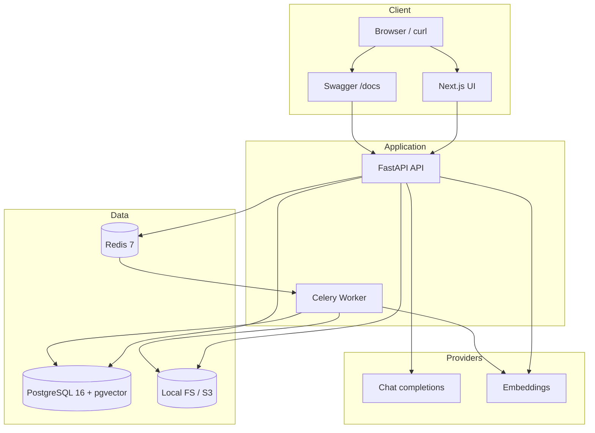

# AtlasOps AI

Multi-tenant, workspace-scoped **RAG** and **incident investigation** backend for engineering teams. Upload runbooks and incident notes, ask grounded questions with citations, and run a controlled tool-based agent — with hard workspace isolation, RBAC, usage tracking, and audit logs.

**MVP product loop**

```text
workspace → document upload → ingestion → vector search → grounded answer → agent investigation → usage visibility
```

Portfolio demo tenant: **Northstar Cloud**.

---

## Quick start (local demo under 30 minutes)

Prerequisites: Docker Desktop (or equivalent), a shell, **`jq`**, and a **real**
`OPENAI_API_KEY` (or Anthropic key if `LLM_PROVIDER=anthropic`). Live grounded
answers are the success path for this demo — a Compose placeholder key is enough
to **boot** the stack, but **not** enough for seed ingestion or RAG/agent calls.

### 0. Set a real LLM API key (required before seed + query)

```bash
cp .env.example .env
# Edit .env — set OPENAI_API_KEY=sk-... (or ANTHROPIC_API_KEY + LLM_PROVIDER=anthropic)
```

Compose interpolates `OPENAI_API_KEY` / `ANTHROPIC_API_KEY` / `LLM_PROVIDER` from
`.env` (or the shell) into `api`, `worker`, and `migrate`. After changing the
key on a running stack:

```bash
docker compose up -d --force-recreate api
# Recreate worker too if you use document upload → Celery ingestion (not needed for seed).
```

### 1. Start the stack

```bash
docker compose up --build
```

| Service | URL |
|---------|-----|
| API | http://localhost:8000 |
| Health (ready) | http://localhost:8000/health/ready |
| Swagger UI | http://localhost:8000/docs |
| ReDoc | http://localhost:8000/redoc |
| Web UI | http://localhost:3000 |
| Flower (optional profile) | `docker compose --profile flower up` → http://localhost:5555 — **no auth; local-only** (do not expose beyond localhost) |

Wait until `api` is healthy (`curl -sf http://localhost:8000/health/ready`).

### 2. Seed the Northstar Cloud demo

Seed runs **synchronous** ingestion **in-process** inside the `api` container
(`process_ingestion_job(...)` directly). A Celery **worker is not required** for
seed. The real provider key from step 0 **is** required (embeddings + indexing).

```bash
docker compose exec api python -m scripts.seed_demo
# After editing demo_data/, force re-index:
docker compose exec api python -m scripts.seed_demo --force
```

Creates (idempotent) — **local demo credentials only**; change before any
shared or internet-facing deploy:

| Item | Value |
|------|--------|
| User | `demo@northstar.cloud` |
| Password | `northstar-demo` (override with `--password` / `DEMO_SEED_PASSWORD`) |
| Workspace | **Northstar Cloud** (`northstar-cloud`) |
| Documents | fixtures under `demo_data/` |

### 3. Get a JWT and ask a demo question

```bash
# Login
TOKEN=$(curl -s http://localhost:8000/auth/login \
  -H 'Content-Type: application/json' \
  -d '{"email":"demo@northstar.cloud","password":"northstar-demo"}' \
  | jq -r .access_token)

# Resolve workspace id
WS=$(curl -s http://localhost:8000/workspaces \
  -H "Authorization: Bearer $TOKEN" \
  | jq -r '.items[] | select(.slug=="northstar-cloud") | .id')

# RAG query (demo question)
curl -s "http://localhost:8000/workspaces/$WS/query" \
  -H "Authorization: Bearer $TOKEN" \
  -H 'Content-Type: application/json' \
  -d '{"question":"What should I check for billing 502 errors after deployment?"}' \
  | jq .
```

Or use **Authorize** in http://localhost:8000/docs with the same token, then try
`POST /workspaces/{workspace_id}/query` (example payloads are pre-filled).
Swagger `persistAuthorization` keeps the JWT in the browser until cleared.

Expected: grounded answer with citations from billing runbook / incident docs.

### 4. Optional: agent investigation

```bash
curl -s "http://localhost:8000/workspaces/$WS/agent-runs" \
  -H "Authorization: Bearer $TOKEN" \
  -H 'Content-Type: application/json' \
  -d '{"objective":"Investigate billing API 502 errors after the latest deployment."}' \
  | jq .
```

### Local web UI (without rebuilding the image)

```bash
cd web
cp .env.example .env.local
npm install
npm run dev
```

---

## Architecture (at a glance)



| Layer | Choice |
|-------|--------|
| Backend | Python **3.11+** (image `python:3.11-slim`), FastAPI, modular monolith ([ADR-001](docs/adr/ADR-001-backend-architecture-style.md)) |
| Database | PostgreSQL 16 + **pgvector** ([ADR-002](docs/adr/ADR-002-vector-store-choice.md)) |
| Queue | Redis 7 + Celery ([ADR-004](docs/adr/ADR-004-background-job-processing.md)) |
| Auth | Email/password, **HS256 JWT** Bearer ([docs/09-security-and-rbac.md](docs/09-security-and-rbac.md)) |
| Storage | Local FS (dev) / S3 (cloud) |
| LLM | OpenAI or Anthropic via provider abstraction ([ADR-003](docs/adr/ADR-003-llm-provider-abstraction.md)) |
| Deploy | Docker Compose local; AWS ECS Fargate target ([ADR-008](docs/adr/ADR-008-deployment-target.md)) |

Full package: **[docs/README.md](docs/README.md)** · Mermaid sources under [`docs/diagrams/`](docs/diagrams/).

---

## Environment variables

Copy [`.env.example`](.env.example) for host-native tools. Compose injects defaults for `api` / `worker` / `migrate` (see `docker-compose.yml`).

### Required

| Variable | Purpose |
|----------|---------|
| `DATABASE_URL` | PostgreSQL URL (`postgresql+psycopg2://…`) |
| `REDIS_URL` | Redis broker URL |
| `JWT_SECRET_KEY` | HS256 signing secret (non-empty) |
| `STORAGE_BACKEND` | `local` or `s3` |
| `LLM_PROVIDER` | `openai` or `anthropic` |
| `OPENAI_API_KEY` / `ANTHROPIC_API_KEY` | Required for the selected provider (**real** key required for seed + live RAG/agent demo) |

### Conditional

| Variable | When |
|----------|------|
| `S3_BUCKET`, `AWS_REGION` | `STORAGE_BACKEND=s3` |
| `STORAGE_PATH` | Local upload root (default `/uploads`) |

### Common optional defaults

| Variable | Default | Purpose |
|----------|---------|---------|
| `JWT_EXPIRY_HOURS` | `24` | Access token lifetime |
| `EMBEDDING_MODEL` | `text-embedding-3-small` | Embedding model |
| `CHAT_MODEL` | `gpt-4o-mini` | Chat model |
| `RETRIEVAL_MIN_SCORE` | `0.45` | Min cosine similarity for RAG context |
| `CHUNK_SIZE_TOKENS` | `1000` | Target chunk size |
| `CHUNK_OVERLAP_TOKENS` | `150` | Chunk overlap |
| `EMBEDDING_BATCH_SIZE` | `64` | Embed batch size |
| `MAX_UPLOAD_BYTES` | `20971520` | Upload size limit (~20 MiB) |
| `ENVIRONMENT` | `development` | `development` / `staging` / `production` |
| `LOG_LEVEL` | `INFO` | Structured logging level |
| `CORS_ORIGINS` | *(empty → localhost:3000 in dev)* | Browser origins |
| `WORKER_HEARTBEAT_INTERVAL_SECONDS` | `300` | Worker heartbeat log interval |
| `CELERY_DEFAULT_QUEUE` | `celery` | Celery queue / Redis `LLEN` key |

```bash
# Faster local heartbeats while debugging
WORKER_HEARTBEAT_INTERVAL_SECONDS=60 docker compose up --build
```

Confirm worker: `docker compose logs -f worker | grep worker_heartbeat`  
Queue depth: `curl -s http://localhost:8000/health/ready | jq .queue_depth`

---

## Security & workspace isolation

**Isolation is mandatory.** Every tenant-owned entity carries `workspace_id` (documents, chunks, ingestion jobs, conversations, agent runs, usage, audit). Enforcement is defense-in-depth ([ADR-005](docs/adr/ADR-005-workspace-isolation-model.md)):

1. **AuthN** — Bearer JWT (`Authorization: Bearer <token>`)
2. **AuthZ / membership** — workspace routes resolve membership + RBAC before handlers
3. **Data layer** — repositories filter by `workspace_id`; vector search never runs unscoped

Cross-workspace resource IDs return **404** (not 403) to avoid enumeration. Non-members hitting a workspace boundary get **403**.

Roles: **Owner**, **Admin**, **Member**, **Viewer** — see [docs/09-security-and-rbac.md](docs/09-security-and-rbac.md). Sensitive actions emit audit events; AI calls emit usage events.

Security tests live under `tests/security/` (Docker/testcontainers).

---

## Design tradeoffs (MVP)

| Decision | Why (short) | Details |
|----------|-------------|---------|
| **pgvector in Postgres** vs dedicated vector DB | One store for metadata + vectors, ACID deletes/re-index, strong `workspace_id` filter in the same SQL; corpus is demo-scale | [ADR-002](docs/adr/ADR-002-vector-store-choice.md) |
| **Stateless HS256 JWT** | Simple portfolio auth; no SSO; logout is client discard (no Redis blocklist in MVP) | [docs/09-security-and-rbac.md](docs/09-security-and-rbac.md) |
| **Token chunking (~1000 / 150 overlap)** | Balances retrieval precision vs context window; paragraph-aware with heading prefixes | [docs/07-rag-architecture.md](docs/07-rag-architecture.md), [ING-003](docs/implementation-notes/ING-003.md) |
| **Modular monolith + Celery** | Clear module boundaries without microservice ops tax; async ingestion only | [ADR-001](docs/adr/ADR-001-backend-architecture-style.md), [ADR-004](docs/adr/ADR-004-background-job-processing.md) |
| **Allow-listed agent tools** | Controlled investigation; no shell, no mutations, no external remediation | [ADR-006](docs/adr/ADR-006-agent-tool-execution-model.md) |

---

## API documentation

- Interactive: [`/docs`](http://localhost:8000/docs) (Swagger) and [`/redoc`](http://localhost:8000/redoc)
- Contract narrative: [docs/06-api-design.md](docs/06-api-design.md)
- OpenAPI JSON: http://localhost:8000/openapi.json

`/docs`, `/redoc`, and `/openapi.json` are **local-demo** surfaces — leave them
on localhost for portfolio use; restrict at the network edge before any shared
or internet-facing deploy. Swagger UI enables `persistAuthorization` (JWT
retained in the browser until you clear it).

Key authenticated routes (after login): workspaces, documents, `POST .../query`, `POST .../agent-runs`, admin aggregates under `/workspaces/{workspace_id}/admin/`.

---

## Testing

```bash
pytest tests/unit -q
pytest tests/integration tests/api tests/security -q  # requires Docker (testcontainers)
```

CI (`.github/workflows/ci.yml`) uses the same globs: unit job → `tests/unit`; integration job → `tests/api`, `tests/integration`, `tests/security`. API/security tests skip when Docker is unavailable.

Strategy: [docs/13-testing-strategy.md](docs/13-testing-strategy.md).

---

## Usage cost estimates

AtlasOps records token usage on every LLM and embedding call and attaches an
`estimated_cost_usd` using a static price table in
`app/modules/usage/cost_calculator.py` (USD per 1K tokens, blended per model).

These figures are **approximate portfolio/demo estimates, not invoices**. Prefer
provider invoices for real spend.

Admin summary (Owner/Admin): `GET /workspaces/{workspace_id}/admin/usage`  
Also: `documents-overview`, `ingestion-jobs`, `recent-questions`, `failed-jobs`, `audit-logs` under `/workspaces/{workspace_id}/admin/`.

---

## Documentation map

| Doc | Start here for… |
|-----|-----------------|
| [docs/README.md](docs/README.md) | Architecture index |
| [docs/01-system-overview.md](docs/01-system-overview.md) | Product loop & non-goals |
| [docs/02-architecture-diagram.md](docs/02-architecture-diagram.md) / [03-container-diagram.md](docs/03-container-diagram.md) | System & container views |
| [docs/07-rag-architecture.md](docs/07-rag-architecture.md) | Retrieval & grounding |
| [docs/08-agent-architecture.md](docs/08-agent-architecture.md) | Agent tools & guardrails |
| [docs/09-security-and-rbac.md](docs/09-security-and-rbac.md) | Auth, RBAC, isolation |
| [docs/12-deployment-architecture.md](docs/12-deployment-architecture.md) | Local vs cloud deploy |
| [docs/adr/](docs/adr/) | Accepted architecture decisions |
| [stories/](stories/README.md) | MVP user stories |
| [PRD.md](PRD.md) | Product requirements |

---

## Out of scope (MVP)

Slack/GitHub/Notion integrations, SSO, billing, streaming answers, Kubernetes, dedicated vector DB migration, real external remediation — see [docs/01-system-overview.md](docs/01-system-overview.md).
