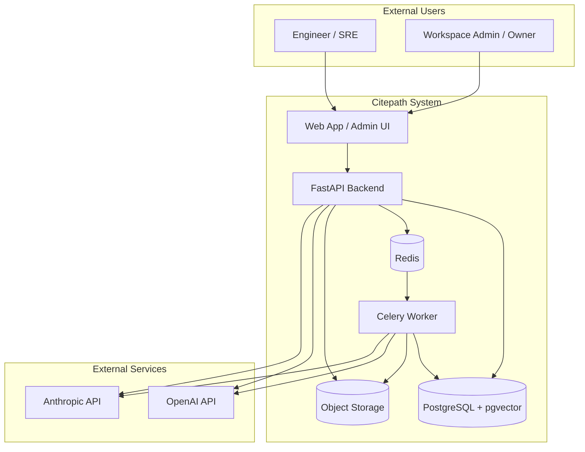

# Architecture Diagram — System Context

High-level view of Citepath MVP and its external dependencies.

## Narrative

Engineers and workspace admins interact with a **minimal web UI** (or Swagger) that calls the **FastAPI backend**. The API handles authentication, workspace RBAC, document metadata, RAG queries, and agent runs synchronously. **Document ingestion** is delegated to a **Celery worker** via **Redis**.

All application state lives in **PostgreSQL** with **pgvector** for chunk embeddings. Raw files live in **object storage** (local volume in dev, S3 in cloud). **OpenAI** and/or **Anthropic** provide chat completions; embeddings typically come from OpenAI.

There is no separate vector database, search engine, or microservice mesh in MVP.

## System Context Diagram

Source: [diagrams/system-context.mmd](./diagrams/system-context.mmd)

## Trust Boundaries

| Boundary | Inside | Outside |
|----------|--------|---------|
| Tenant data | PostgreSQL rows scoped by `workspace_id` | Other workspaces, other customers |
| File storage | Prefix per workspace in bucket/path | Public internet access to raw files |
| AI providers | Prompts contain retrieved chunks only for active workspace | Provider may log per their policy — document in security doc |
| Agent tools | Read-only KB operations | No production infra APIs |

## Request Paths

| Path | Entry | Exit |
|------|-------|------|
| Upload | `POST .../documents` | 202 + job id; worker completes indexing |
| Query | `POST .../query` | 200 + answer + citations |
| Agent | `POST .../agent-runs` | 200 + structured investigation |
| Admin | `GET .../admin/*` | 200 + aggregates (Owner/Admin only) |
