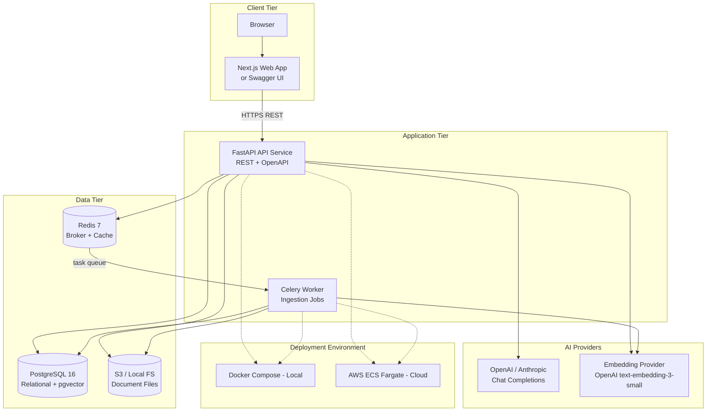

# Container Diagram

C4-style container view of the AtlasOps AI MVP deployable units.

## Containers

| Container | Technology | Description |
|-----------|------------|-------------|
| Web App | Next.js (or Swagger UI) | Calls REST API; minimal admin views |
| API Service | FastAPI + Uvicorn | HTTP API, auth, RAG, agents, admin |
| Worker Service | Celery | Ingestion tasks, re-index |
| Database | PostgreSQL 16 + pgvector | All relational + vector data |
| Queue/Cache | Redis 7 | Celery broker; optional token blocklist |
| File Storage | Local FS / AWS S3 | Uploaded document binaries |
| LLM Providers | OpenAI, Anthropic | Chat completions (one active via config) |
| Embedding Provider | OpenAI API | `text-embedding-3-small` default |

## Container Diagram

Source: [diagrams/container-diagram.mmd](./diagrams/container-diagram.mmd)

## Container Responsibilities

### API Service

- JWT validation, RBAC, workspace context injection
- Document upload orchestration (store file, enqueue job)
- RAG and agent orchestration (retrieval + LLM calls)
- Usage and audit event emission
- Health and metrics endpoints

### Worker Service

- `process_ingestion_job(job_id)` — full pipeline
- `reindex_document(document_id)` — delete old chunks, re-run pipeline
- Idempotent chunk upsert keyed by `(workspace_id, document_id, chunk_index)`
- Retries: Celery autoretry for transient failures (max 3, exponential backoff)

### Database

Single source of truth. pgvector HNSW or IVFFlat index on `document_chunks.embedding` with `workspace_id` in every similarity query predicate.

### Redis

Celery broker only for MVP. Result backend optional (prefer DB job status over Celery results).

## Deployment Mapping

| Container | Local | Cloud |
|-----------|-------|-------|
| API | `docker compose` service `api` | ECS Fargate service `atlasops-api` |
| Worker | `docker compose` service `worker` | ECS Fargate service `atlasops-worker` |
| PostgreSQL | `postgres` container | RDS PostgreSQL |
| Redis | `redis` container | ElastiCache Redis |
| Storage | Docker volume | S3 bucket |
