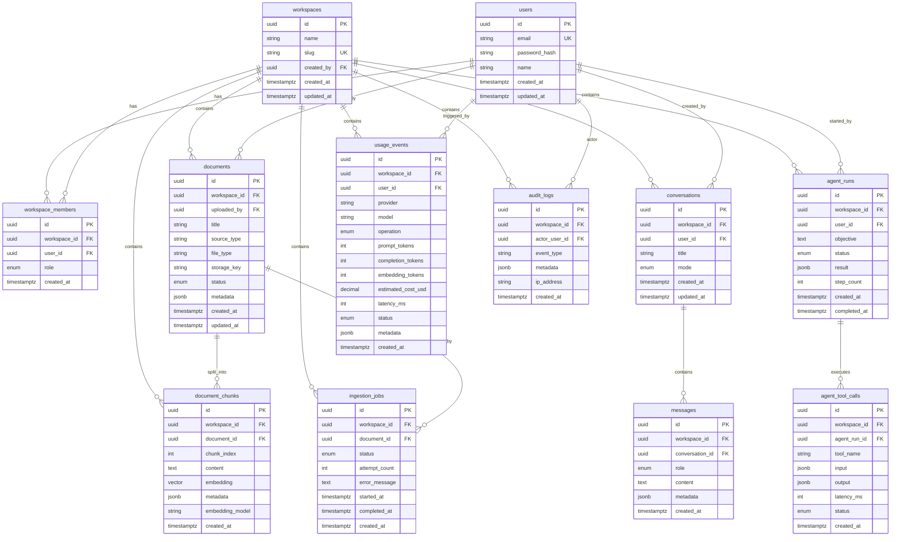

# Data Model

Implementation-ready schema for Citepath MVP. All tenant-owned tables include `workspace_id` and composite indexes starting with `workspace_id`.

## Entity Relationship Diagram

---

## `users`

| Field | Type | Notes |
|-------|------|-------|
| `id` | UUID PK | `gen_random_uuid()` |
| `email` | VARCHAR(255) UNIQUE NOT NULL | Lowercase normalized |
| `password_hash` | VARCHAR(255) NOT NULL | bcrypt |
| `name` | VARCHAR(255) | Optional |
| `created_at` | TIMESTAMPTZ | |
| `updated_at` | TIMESTAMPTZ | |

**Indexes:** `UNIQUE (email)`

**Workspace scoping:** Global entity. Access to workspace data only via `workspace_members`.

**Retention:** Indefinite for MVP.

---

## `workspaces`

| Field | Type | Notes |
|-------|------|-------|
| `id` | UUID PK | |
| `name` | VARCHAR(255) NOT NULL | Display name |
| `slug` | VARCHAR(128) NOT NULL UNIQUE | URL-safe identifier; lowercase letters, digits, hyphens |
| `created_by` | UUID FK → users | |
| `created_at` | TIMESTAMPTZ | |
| `updated_at` | TIMESTAMPTZ | |

**Indexes:** `INDEX (created_by)`, `UNIQUE INDEX ix_workspaces_slug (slug)`

**Workspace scoping:** Top-level tenant root.

---

## `workspace_members`

| Field | Type | Notes |
|-------|------|-------|
| `id` | UUID PK | |
| `workspace_id` | UUID FK → workspaces NOT NULL | |
| `user_id` | UUID FK → users NOT NULL | |
| `role` | ENUM | `owner`, `admin`, `member`, `viewer` |
| `created_at` | TIMESTAMPTZ | |

**Indexes:** `UNIQUE (workspace_id, user_id)`, `INDEX (user_id)`

**Workspace scoping:** Membership row ties user to workspace.

**Constraints:** At least one `owner` per workspace (enforced in service layer).

---

## `documents`

| Field | Type | Notes |
|-------|------|-------|
| `id` | UUID PK | |
| `workspace_id` | UUID FK NOT NULL | **Mandatory filter** |
| `uploaded_by` | UUID FK → users | |
| `title` | VARCHAR(512) | From filename or metadata |
| `source_type` | VARCHAR(64) | e.g. `runbook`, `incident`, `architecture`, `general` |
| `file_type` | VARCHAR(16) | `pdf`, `md`, `txt`, `json` |
| `storage_key` | VARCHAR(1024) | Path/key in object storage |
| `status` | ENUM | `uploaded`, `processing`, `indexed`, `failed` |
| `metadata` | JSONB | Page count, original filename, etc. |
| `created_at` | TIMESTAMPTZ | |
| `updated_at` | TIMESTAMPTZ | |

**Indexes:** `INDEX (workspace_id, created_at DESC)`, `INDEX (workspace_id, status)`

**Workspace scoping:** `workspace_id` on every row. FK `(workspace_id, id)` pattern optional for strict DB-level enforcement.

**Retention:** Hard delete removes file from storage and cascades chunks (application-level).

---

## `document_chunks`

| Field | Type | Notes |
|-------|------|-------|
| `id` | UUID PK | Citation ID |
| `workspace_id` | UUID FK NOT NULL | **Mandatory for vector search filter** |
| `document_id` | UUID FK → documents | |
| `chunk_index` | INT NOT NULL | Order within document |
| `content` | TEXT NOT NULL | Chunk text |
| `embedding` | vector(1536) | pgvector; dimension matches model |
| `metadata` | JSONB | `section_heading`, `page_number`, `token_count` |
| `embedding_model` | VARCHAR(128) | e.g. `text-embedding-3-small` |
| `created_at` | TIMESTAMPTZ | |

**Indexes:**
- `UNIQUE (workspace_id, document_id, chunk_index)`
- `INDEX (workspace_id, document_id)`
- `CREATE INDEX ON document_chunks USING hnsw (embedding vector_cosine_ops)` with partial/filter via query predicate on `workspace_id`

**Workspace scoping:** Vector queries: `WHERE workspace_id = $1 ORDER BY embedding <=> $2 LIMIT k`

**Retention:** Deleted when parent document deleted or re-indexed.

---

## `ingestion_jobs`

| Field | Type | Notes |
|-------|------|-------|
| `id` | UUID PK | |
| `workspace_id` | UUID FK NOT NULL | |
| `document_id` | UUID FK NOT NULL | |
| `status` | ENUM | `pending`, `processing`, `completed`, `failed` |
| `attempt_count` | INT DEFAULT 0 | |
| `error_message` | TEXT | Truncated stack on failure |
| `started_at` | TIMESTAMPTZ | |
| `completed_at` | TIMESTAMPTZ | |
| `created_at` | TIMESTAMPTZ | |

**Indexes:** `INDEX (workspace_id, status, created_at DESC)`, `INDEX (document_id)`

**Workspace scoping:** Admin queries filter by `workspace_id`.

---

## `conversations`

| Field | Type | Notes |
|-------|------|-------|
| `id` | UUID PK | |
| `workspace_id` | UUID FK NOT NULL | |
| `user_id` | UUID FK → users | Creator |
| `title` | VARCHAR(512) | Auto from first question |
| `mode` | ENUM | `rag`, `agent` |
| `created_at` | TIMESTAMPTZ | |
| `updated_at` | TIMESTAMPTZ | |

**Indexes:** `INDEX (workspace_id, user_id, created_at DESC)`

---

## `messages`

| Field | Type | Notes |
|-------|------|-------|
| `id` | UUID PK | |
| `workspace_id` | UUID FK NOT NULL | Denormalized for isolation checks |
| `conversation_id` | UUID FK NOT NULL | |
| `role` | ENUM | `user`, `assistant`, `system` |
| `content` | TEXT NOT NULL | |
| `metadata` | JSONB | `citations`, `confidence`, `retrieval_scores` |
| `created_at` | TIMESTAMPTZ | |

**Indexes:** `INDEX (conversation_id, created_at)`, `INDEX (workspace_id, created_at DESC)`

**Workspace scoping:** Load conversation with `workspace_id` match before returning messages.

---

## `agent_runs`

| Field | Type | Notes |
|-------|------|-------|
| `id` | UUID PK | |
| `workspace_id` | UUID FK NOT NULL | |
| `user_id` | UUID FK NOT NULL | |
| `objective` | TEXT NOT NULL | User-provided incident description |
| `status` | ENUM | `running`, `completed`, `failed` |
| `result` | JSONB | Structured final output |
| `step_count` | INT | Tool steps executed |
| `created_at` | TIMESTAMPTZ | |
| `completed_at` | TIMESTAMPTZ | |

**Indexes:** `INDEX (workspace_id, created_at DESC)`, `INDEX (workspace_id, status)`

---

## `agent_tool_calls`

| Field | Type | Notes |
|-------|------|-------|
| `id` | UUID PK | |
| `workspace_id` | UUID FK NOT NULL | |
| `agent_run_id` | UUID FK NOT NULL | |
| `tool_name` | VARCHAR(128) NOT NULL | Registry name |
| `input` | JSONB | Validated tool args |
| `output` | JSONB | Result + citation refs |
| `latency_ms` | INT | |
| `status` | ENUM | `success`, `failed` |
| `created_at` | TIMESTAMPTZ | |

**Indexes:** `INDEX (agent_run_id, created_at)`, `INDEX (workspace_id, created_at DESC)`

---

## `usage_events`

| Field | Type | Notes |
|-------|------|-------|
| `id` | UUID PK | |
| `workspace_id` | UUID FK NOT NULL | |
| `user_id` | UUID FK | Nullable for system/worker events |
| `provider` | VARCHAR(64) | `openai`, `anthropic` |
| `model` | VARCHAR(128) | |
| `operation` | ENUM | `chat_completion`, `embedding` (legacy), `embedding_document`, `embedding_query`, `agent_step` |
| `prompt_tokens` | INT DEFAULT 0 | |
| `completion_tokens` | INT DEFAULT 0 | |
| `embedding_tokens` | INT DEFAULT 0 | |
| `estimated_cost_usd` | DECIMAL(10,6) | From static price table |
| `latency_ms` | INT | |
| `status` | ENUM | `success`, `failed` |
| `metadata` | JSONB | `document_id`, `conversation_id`, `agent_run_id` |
| `created_at` | TIMESTAMPTZ | |

**Indexes:** `INDEX (workspace_id, created_at DESC)`, `INDEX (workspace_id, operation, created_at)`

**Retention:** Keep all for MVP; partition by month post-MVP if volume grows.

---

## `audit_logs`

| Field | Type | Notes |
|-------|------|-------|
| `id` | UUID PK | |
| `workspace_id` | UUID FK NOT NULL | |
| `actor_user_id` | UUID FK | Null for system |
| `event_type` | VARCHAR(64) | See audit module |
| `metadata` | JSONB | Resource ids, old/new role, etc. |
| `ip_address` | VARCHAR(45) | From request |
| `created_at` | TIMESTAMPTZ | Append-only |

**Indexes:** `INDEX (workspace_id, created_at DESC)`, `INDEX (workspace_id, event_type, created_at DESC)`

**Retention:** Append-only; no updates/deletes in application code.

---

## Migration Notes

1. Enable extension: `CREATE EXTENSION IF NOT EXISTS vector;`
2. Run Alembic migrations in CI before deploy.
3. Seed script creates demo user, workspace, and Northstar Cloud documents (INFRA-004).
4. Embedding dimension migration requires re-index all documents if model changes.

## Cross-Workspace Leakage Prevention

- All repository methods require `workspace_id: UUID` parameter.
- Foreign keys from child → parent include workspace consistency checks in service layer before insert.
- Integration tests: user A cannot `GET /workspaces/{B}/documents/{id}` even with valid UUID.
