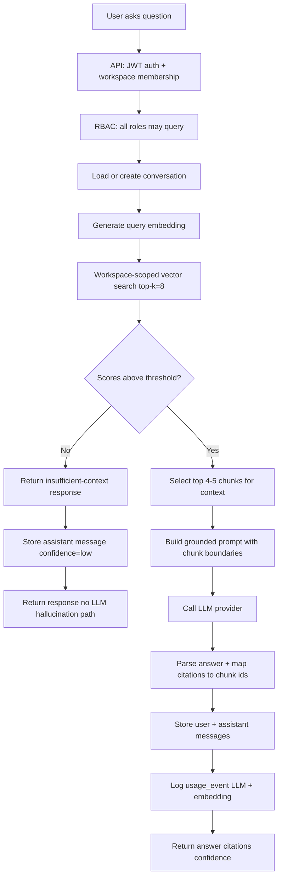

# RAG Architecture

Retrieval-augmented generation for workspace-scoped Q&A. Design goal: **reduce hallucination** by grounding every factual claim in retrieved chunks.

## Flow Diagram



Source: [diagrams/rag-query-flow.mmd](./diagrams/rag-query-flow.mmd)

---

## Document Preprocessing (Ingestion Side)

RAG quality depends on ingestion. See [10-ingestion-pipeline.md](./10-ingestion-pipeline.md).

| Format | Extractor |
|--------|-----------|
| `.md`, `.txt` | UTF-8 read; preserve headings |
| `.pdf` | `pypdf` or `pdfplumber`; page numbers in metadata |
| `.json` | Pretty-print or extract `text`/`content` fields |

Normalize whitespace; strip null bytes.

## Chunking Strategy

| Parameter | Value |
|-----------|-------|
| Target chunk size | 800–1,200 tokens |
| Overlap | 100–200 tokens |
| Splitter | Recursive by `\n\n`, `\n`, sentence boundaries |
| Preserve | Section headings prepended to chunk text |

Each chunk stores metadata: `document_title`, `section_heading`, `page_number`, `source_type`, `chunk_index`, `token_count`.

## Embedding Generation

- Model: `text-embedding-3-small` (1536 dims) default
- Batch size: 64 chunks per API call
- Store `embedding_model` on chunk for re-index decisions
- Log embedding `usage_event` per batch

## Vector Storage

PostgreSQL `document_chunks.embedding` with pgvector. Cosine distance operator `<=>`.

## Retrieval Strategy

1. Embed user question (same model as ingestion)
2. SQL similarity search:

```sql
SELECT id, document_id, content, metadata,
       1 - (embedding <=> :query_embedding) AS score
FROM document_chunks
WHERE workspace_id = :workspace_id
  AND (:source_type IS NULL OR metadata->>'source_type' = :source_type)
ORDER BY embedding <=> :query_embedding
LIMIT 8;
```

3. Optional metadata filter: `source_type`, `document_id` (RET-004)
4. Drop chunks with `score < 0.72` (configurable `RETRIEVAL_MIN_SCORE`)
5. Compress to top **4–5** chunks by score for LLM context window

## Workspace Filtering

**Non-negotiable:** `workspace_id` in SQL `WHERE` clause, never applied only in application memory after fetch.

## Citation Generation

1. Pass chunks to LLM with labeled boundaries: `[CHUNK:uuid] ... [/CHUNK]`
2. Instruct model to reference chunk IDs for claims
3. Post-process: validate cited IDs ⊆ retrieved set
4. Response includes: `chunk_id`, `document_title`, `chunk_preview` (200 chars), `score`, metadata

If model cites invalid ID, strip citation and log warning.

## Insufficient Context Behavior (RAG-005)

Trigger when:
- Zero chunks returned, OR
- All scores below `RETRIEVAL_MIN_SCORE`

Behavior:
- Set `insufficient_context: true`, `confidence: "low"`
- Return template message: acknowledge gap, suggest uploading relevant docs
- **Do not** call LLM with empty context to invent runbook steps
- Optional: call LLM with strict refusal-only prompt (no domain content) — prefer skip entirely for MVP

Store assistant message with empty citations array.

## Token Optimization

| Technique | MVP implementation |
|-----------|---------------------|
| Top-k then trim to 4–5 | Yes |
| Chunk metadata only in citation response | Full chunk in prompt, preview in API |
| Conversation history | Last 4 turns max in prompt |
| Max prompt tokens | Cap at 6,000 input tokens; truncate oldest history first |

## Prompt Template Boundaries

**System prompt (fixed):**

- Answer only from provided CHUNK blocks
- If chunks insufficient, say so explicitly
- Cite chunk IDs for factual claims
- Do not invent service names, configs, or procedures not in chunks
- Use engineering tone; structured bullets when helpful

**User prompt:**

- Question text
- Optional conversation history (bounded)
- Retrieved chunks with IDs

**Forbidden in prompts:** Chunks from other workspaces; raw system secrets; user password data.

## Retrieval Quality Considerations

- Heading-aware chunking improves runbook retrieval
- `source_type` filter helps incident vs architecture questions
- Demo seed dataset (Northstar Cloud) validates end-to-end quality
- No reranker in MVP — rely on embedding quality and threshold

## Multi-Turn Conversations (RAG-006, RAG-007)

- Persist user and assistant messages
- Follow-up questions include prior turns (max 4)
- Re-retrieve on each turn (do not reuse stale chunks blindly)

## Confidence Levels

| Level | Condition |
|-------|-----------|
| `high` | Top score ≥ 0.85 and ≥ 2 chunks above threshold |
| `medium` | Top score ≥ 0.72 |
| `low` | Insufficient context path |

## MVP Limitations

- No hybrid BM25 + vector search
- No cross-encoder reranking
- No streaming
- Single embedding model per environment
- English-only content assumed

## What Gets Logged

Each query logs:
- Embedding usage event
- Chat completion usage event
- `conversation_id`, chunk IDs retrieved, scores (in message metadata)
