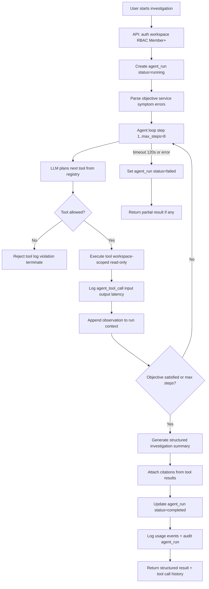

# Agent Architecture

Controlled, tool-based **incident investigation** agent for MVP. The agent reasons over workspace knowledge using a **whitelist tool registry** — no external side effects.

## Agent Purpose

Help engineers investigate operational issues by:
- Searching indexed runbooks and incident reports
- Summarizing relevant documents
- Comparing past incidents
- Extracting action items
- Suggesting debugging steps grounded in retrieved content

## MVP Mode

Single mode: **`incident_investigation`**. Triggered via `POST /workspaces/{workspace_id}/agent-runs`.

## Flow Diagram



Source: [diagrams/agent-run-flow.mmd](./diagrams/agent-run-flow.mmd)

---

## Agent Lifecycle

| State | Description |
|-------|-------------|
| `running` | Loop in progress |
| `completed` | Structured summary produced |
| `failed` | Timeout, provider error, or unrecoverable tool failure |

Steps:
1. Create `agent_run` with objective
2. Parse objective for service names, symptoms, error codes (lightweight regex + LLM)
3. Loop: plan → validate tool → execute → observe
4. Terminate at max steps (8) or when LLM signals completion
5. Generate structured final answer (AGENT-008)
6. Write audit event `agent_run_completed`

**Limits:** Max 8 tool calls; 120s wall-clock timeout; 16,000 tokens total per run (soft cap).

## Tool Registry

Static registry loaded at startup. LLM receives JSON schema for allowed tools only.

### Allowed MVP Tools

| Tool | Purpose | Args |
|------|---------|------|
| `search_knowledge_base` | Vector search over workspace | `query`, optional `filters`, `top_k` |
| `summarize_document` | Summarize one document by ID | `document_id` |
| `extract_action_items` | Action items from document | `document_id` |
| `compare_incidents` | Compare 2–5 incident docs | `document_ids[]` |
| `suggest_debugging_steps` | Steps from KB for service/symptom | `service_name`, `symptom` |

All tools:
- Require `workspace_id` from context (injected by executor, not LLM)
- Read-only; no mutations
- Return `{ "content", "citations": [...] }`

### Forbidden Actions

- Shell execution, file write/delete
- HTTP calls to customer infrastructure
- Database writes beyond logging
- Tools not in registry (executor rejects before run)
- Cross-workspace document IDs

## Tool Call Logging (AGENT-009)

Every invocation creates `agent_tool_calls` row:
- `tool_name`, `input`, `output`, `latency_ms`, `status`
- Admin/Owner can list via API

## Orchestration Loop

```text
messages = [system_prompt, user_objective]
for step in 1..MAX_STEPS:
    response = llm.chat(messages, tools=registry_schemas)
    if response.finish_reason == "stop" and response.has_final_answer:
        break
    tool_call = response.tool_calls[0]  # one tool per step for MVP
    if tool_call.name not in ALLOWED_TOOLS:
        log violation; break
    result = ToolExecutor.run(tool_call, workspace_context)
    log agent_tool_call
    messages.append(tool_result)
final = llm.chat(messages, response_format=InvestigationSummary)
```

Use provider native function calling (OpenAI tools / Anthropic tools).

## Citation Requirements

- Every factual claim in final summary must reference citations from tool outputs
- `compare_incidents` and `search_knowledge_base` must return chunk-level citations
- Final JSON includes `citations[]` aggregated from tools

## Grounding Requirements

- Tools use same `RetrievalService` as RAG (shared module)
- `summarize_document` loads document chunks from DB, not LLM memory
- `suggest_debugging_steps` must call `search_knowledge_base` internally before generating steps

## Structured Final Answer (AGENT-008)

```json
{
  "problem_statement": "string",
  "likely_causes": ["string"],
  "recommended_checks": ["string"],
  "related_documents": ["document_uuid"],
  "action_items": ["string"]
}
```

Validated with Pydantic before persisting to `agent_run.result`.

## Failure Behavior

| Failure | Behavior |
|---------|----------|
| Tool not in registry | Stop loop; `failed` with reason |
| Document not found | Tool returns error observation; agent may continue |
| LLM timeout | `failed`; partial tool calls retained |
| Max steps reached | Force final summary from accumulated observations |
| Provider 429 | Retry once with backoff; then fail |

## Guardrails

1. **Tool whitelist** — executor validates name before dispatch
2. **Workspace scope** — document IDs validated against `workspace_id`
3. **No destructive tools** — registry has no write-capable entries
4. **Token budget** — truncate tool outputs to 2,000 tokens each
5. **Prompt injection** — document content in tool results wrapped as data, not instructions
6. **Audit** — agent run start/complete logged

## How Agent Differs from RAG Query

| Aspect | RAG Query | Agent |
|--------|-----------|-------|
| Trigger | Single question | Investigation objective |
| Steps | 1 retrieval + 1 LLM call | Multi-step tool loop |
| Tools | None | Up to 5 tool types |
| Output | Answer + citations | Structured investigation summary |
| Duration | ~2–5s | Up to 120s |
| Conversation | RAG mode | Optional link; separate `agent_runs` record |

## Usage Logging

Log `usage_event` per LLM call with `operation: agent_step` and `metadata.agent_run_id`.

## MVP Limitations

- Single agent mode
- No parallel tool calls
- No human-in-the-loop approval
- No streaming progress updates
- Viewer role may run agent (same as RAG ask permission)
