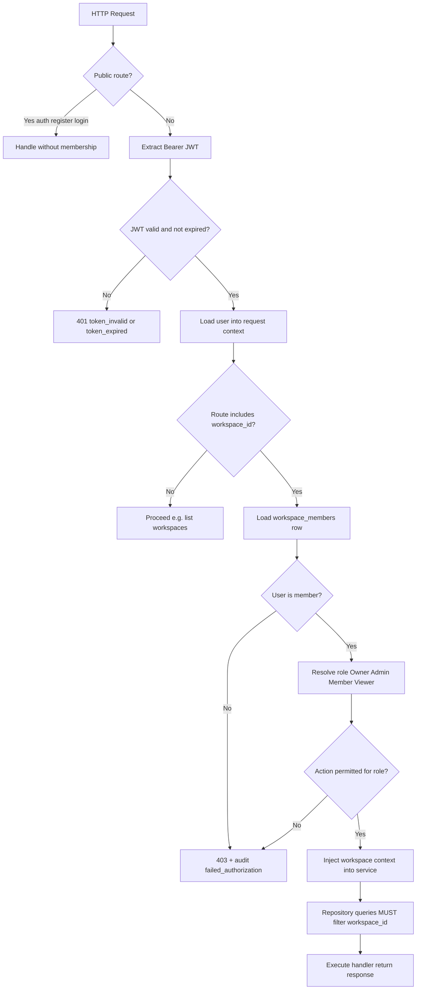

# Security and RBAC

Security model for multi-tenant AtlasOps AI MVP.

## Authentication Model

| Aspect | Decision |
|--------|----------|
| Method | Email + password (no SSO in MVP) |
| Password hashing | **bcrypt**, cost factor 12 |
| Session | Stateless **JWT** (HS256) |
| Token location | `Authorization: Bearer <token>` |
| Claims | `sub` (user id), `exp`, `iat` |
| Expiry | Configurable, default 24 hours |
| Logout | `POST /auth/logout` returns 204; **client must discard JWT** (no Redis blocklist in MVP); optional Redis JWT `jti` blocklist later |

Email normalized to lowercase before storage and lookup.

## JWT / Session Approach

- Secret key from environment (`JWT_SECRET_KEY`); never committed
- Middleware validates signature and expiry on protected routes
- Expired token → `401` with `error.code: token_expired`
- Invalid signature → `401` with `token_invalid`

Optional logout blocklist (P1, **not implemented in MVP**):
- Store `jti` in Redis with TTL = remaining token life
- Middleware checks blocklist after signature validation
- Until then, logout is acknowledgment-only; stolen tokens remain usable until `exp`

## Role Definitions

| Role | Description |
|------|-------------|
| **Owner** | Full control; only role that can delete workspace or assign Owner |
| **Admin** | Manage members (except Owner), documents, admin dashboard, audit logs |
| **Member** | Upload/delete/reindex docs, RAG, agent |
| **Viewer** | Read documents, RAG, agent; no mutations |

## Permission Matrix

| Action | Owner | Admin | Member | Viewer |
|--------|:-----:|:-----:|:------:|:------:|
| Create workspace | ✓ (as creator) | — | — | — |
| Delete workspace | ✓ | ✗ | ✗ | ✗ |
| Invite / remove members | ✓ | ✓ | ✗ | ✗ |
| Change roles | ✓ | ✓* | ✗ | ✗ |
| Upload / delete / reindex docs | ✓ | ✓ | ✓ | ✗ |
| List / view documents | ✓ | ✓ | ✓ | ✓ |
| Ask RAG questions | ✓ | ✓ | ✓ | ✓ |
| Run agent investigation | ✓ | ✓ | ✓ | ✓ |
| View admin dashboard | ✓ | ✓ | ✗ | ✗ |
| View audit logs | ✓ | ✓ | ✗ | ✗ |
| View usage summary | ✓ | ✓ | ✗ | ✗ |

\* Admin cannot assign or modify **Owner** role.

Enforced in `PermissionService.require(workspace_context, action)` — not route-only checks.

## Auth / RBAC Flow



Source: [diagrams/auth-rbac-flow.mmd](./diagrams/auth-rbac-flow.mmd)

## Workspace Isolation Rules

1. Every tenant table row has `workspace_id`
2. URL `{workspace_id}` must match membership before any resource access
3. Resource lookup: `WHERE id = :id AND workspace_id = :workspace_id`
4. Wrong workspace → `404` for resource endpoints (hide existence)
5. Non-member → `403` on workspace endpoints
6. Celery tasks receive `workspace_id` and validate document belongs to workspace before processing

## API Authorization Middleware

FastAPI dependency chain:

```text
get_current_user → get_workspace_context → require_permission(action)
```

`WorkspaceContext` injected into all workspace handlers. Services must not accept bare resource IDs without workspace context.

## Document Access Rules

- List/get: all members
- Upload/delete/reindex: Owner, Admin, Member
- Storage keys include workspace prefix: `{workspace_id}/{document_id}/{filename}`
- Presigned URLs (if used) scoped to object key; short TTL (15 min)

## Vector Search Access Rules

- `RetrievalService.search` requires `workspace_id` parameter
- No global search endpoint
- Agent tools inherit workspace from run context — cannot override via tool args

## Audit Log Requirements

Append-only `audit_logs` for:

| Event | Trigger |
|-------|---------|
| `document.uploaded` | Successful upload |
| `document.deleted` | Document deleted |
| `document.reindex_requested` | Re-index requested |
| `member.role_changed` | Member role updated |
| `failed_authorization` | 403 on protected action |
| `agent_run_started` | Agent run created (not yet emitted in MVP) |
| `agent.run_completed` | Agent run finished (success or failure) |

Fields: `actor_user_id`, `workspace_id`, `event_type`, `metadata`, `ip_address`, `created_at`.

Queryable by Owner/Admin only.

## File Upload Security

| Control | Implementation |
|---------|----------------|
| Allowed types | `.pdf`, `.md`, `.txt`, `.json` — validate extension + MIME sniff |
| Max size | 20 MB default (`MAX_UPLOAD_BYTES`) |
| Malware | Out of scope MVP; document no executable handling |
| Path traversal | Sanitize filename; UUID-based storage keys |
| Content | Extract text only; do not execute embedded scripts |

## Secret Management

| Secret | Storage |
|--------|---------|
| `JWT_SECRET_KEY` | Env / AWS Secrets Manager |
| `DATABASE_URL` | Env / Secrets Manager |
| `OPENAI_API_KEY`, `ANTHROPIC_API_KEY` | Env / Secrets Manager |
| `AWS credentials` | IAM role on ECS task (no static keys) |

Never log secrets. Redact API keys in error traces.

## LLM Data Handling

- Prompts contain retrieved workspace chunks only
- No user password or JWT in prompts
- Provider retention governed by vendor policy — document in README
- MVP: opt-in notice that document content is sent to LLM provider for Q&A
- Do not send data from workspace A while processing workspace B (enforced by retrieval scope)

## Cross-Tenant Leakage Prevention Checklist

- [ ] All repositories require `workspace_id`
- [ ] Integration tests for cross-workspace access attempts
- [ ] Vector SQL always filters `workspace_id`
- [ ] Agent tool document ID validation against workspace
- [ ] Admin aggregates never accept workspace_id from query without membership check
- [ ] Celery tasks re-validate workspace ownership at start
- [ ] Citations only reference chunks from active workspace

## Rate Limiting (Basic)

- Login: 10/min per IP
- Query/agent: 30/min per user per workspace (configurable)
- Upload: 20/hour per workspace

Return `429` with `Retry-After` header.

## Failed Authorization

403 responses trigger `failed_authorization` audit event with attempted action and resource.
