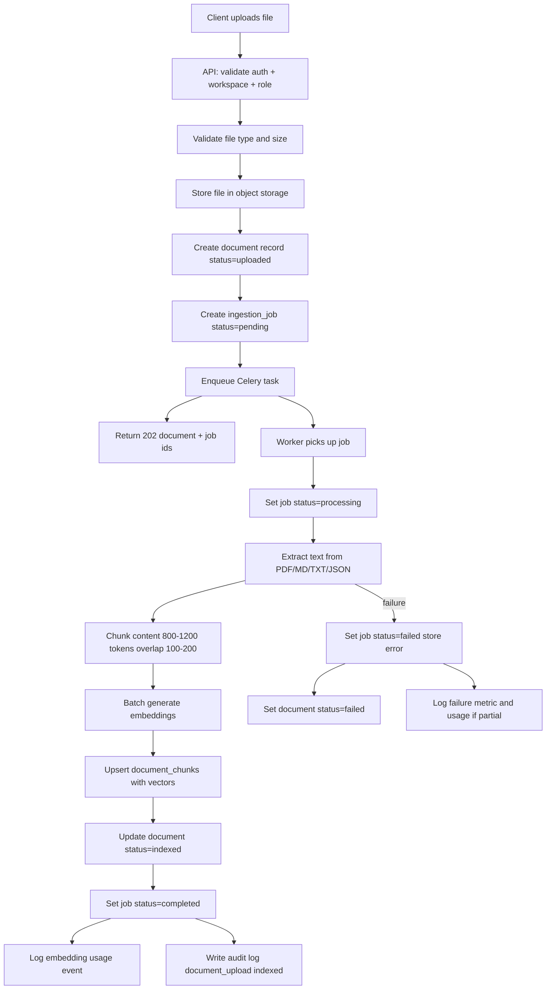

# Ingestion Pipeline

Async pipeline from document upload to indexed vector chunks.

## Flow Diagram

Source: [diagrams/ingestion-flow.mmd](./diagrams/ingestion-flow.mmd)

---

## Upload Flow (API — Synchronous)

1. Validate JWT, workspace membership, role (not Viewer)
2. Validate file extension and content type
3. Validate file size ≤ `MAX_UPLOAD_BYTES`
4. Generate `document_id`; compute `storage_key = {workspace_id}/{document_id}/{safe_filename}`
5. Stream file to storage backend
6. Insert `documents` row (`status=uploaded`)
7. Insert `ingestion_jobs` row (`status=pending`)
8. `process_ingestion_job.delay(job_id)`
9. Return `202` with document and job IDs

## File Validation

| Check | Rule |
|-------|------|
| Extension | `.pdf`, `.md`, `.txt`, `.json` |
| MIME | `application/pdf`, `text/*`, `application/json` |
| Size | ≤ 20 MB |
| Empty file | Reject with 422 |

## Storage Approach

| Environment | Backend |
|-------------|---------|
| Local dev | Filesystem volume `./data/uploads` |
| Cloud | S3 bucket with SSE-S3 |

Interface: `StorageBackend.put(key, stream)`, `get(key)`, `delete(key)`.

## Ingestion Job Creation

One job per upload/re-index. Job tracks `attempt_count`, `error_message`, timestamps.

Document status transitions:
- `uploaded` → `processing` (worker start) → `indexed` | `failed`

## Text Extraction

| Type | Library / approach |
|------|-------------------|
| PDF | `pypdf` — extract per page; store page in metadata |
| Markdown / TXT | Direct read UTF-8 |
| JSON | Extract string fields or full pretty JSON |

On extraction failure: job `failed`, store exception message (truncated 2 KB).

## Chunking

- Tokenizer: `tiktoken` cl100k_base (match embedding model)
- Target 1,000 tokens, overlap 150
- Prepend `# {section_heading}` when available
- Output: list of `{ content, chunk_index, metadata }`

## Embedding Generation

- Batch chunks in groups of 64
- Call embedding provider
- Log `usage_event` per batch (`operation=embedding`)
- On partial batch failure: retry batch once; else fail job

## Vector Persistence

Within DB transaction:
1. Delete existing chunks for document (re-index case)
2. Bulk insert `document_chunks` with embeddings
3. Commit before marking job completed

Use `UNIQUE (workspace_id, document_id, chunk_index)` for idempotent upsert.

## Retry Behavior (ING-007)

| Layer | Policy |
|-------|--------|
| Embedding batch | One in-process micro-retry per batch (ING-004) |
| Celery task | Transient errors → `RetryableIngestionError`; max 3 retries, backoff `2^n` seconds (capped at 60s) |
| Manual retry | Re-index via `POST .../documents/{id}/reindex` (DOC-006); creates a new job |
| attempt_count | Increment on each worker start (includes Celery retries) |

Classification (`app/modules/ingestion/retry.py`):
- **Retryable:** provider/network timeouts, connection errors, rate limits (429/503)
- **Permanent:** empty/no extractable text, unsupported/corrupt content, missing storage key, invalid keys — fail immediately with `error_message`, no Celery autoretry

While auto-retrying, job/document remain `processing`. On retry exhaustion, both become `failed` with the last error message.

## Failure Status

- `ingestion_jobs.status = failed`
- `documents.status = failed`
- `error_message` visible in admin ingestion jobs view
- Metric: `ingestion_failures_total` incremented
- OBS-005: structured error log with `job_id`, `document_id`, `workspace_id`

## Reindexing Behavior (DOC-006)

1. Verify document exists in workspace
2. Create new ingestion job
3. Worker deletes old chunks, re-extracts from stored file
4. Audit event `reindex`

Does not require re-upload if original file still in storage.

## Idempotency Strategy

- Storage upload: if job already `processing` for document, reject duplicate upload with same `Idempotency-Key`
- Worker: if job status already `completed`, exit early (no-op)
- Chunk writes: upsert on `(workspace_id, document_id, chunk_index)`

## Background Worker Responsibilities

Celery worker process runs:
- `process_ingestion_job(job_id: UUID)`
- Does **not** handle HTTP, RAG, or agent requests

Worker health: consumer heartbeat logged; `/health` checks Redis queue connectivity.

## Worker Visibility (OBS-007)

- Log job start/complete/fail with duration
- Admin endpoint shows pending/processing/failed counts
- Optional: Celery inspect for active tasks in health check

## Usage on Failure

Log embedding usage for successful batches even if later step fails. Failed provider calls log `status=failed` usage event.

## MVP Limitations

- Single worker concurrency sufficient
- No priority queues
- No OCR for scanned PDFs
- No incremental chunk updates — full re-index only
