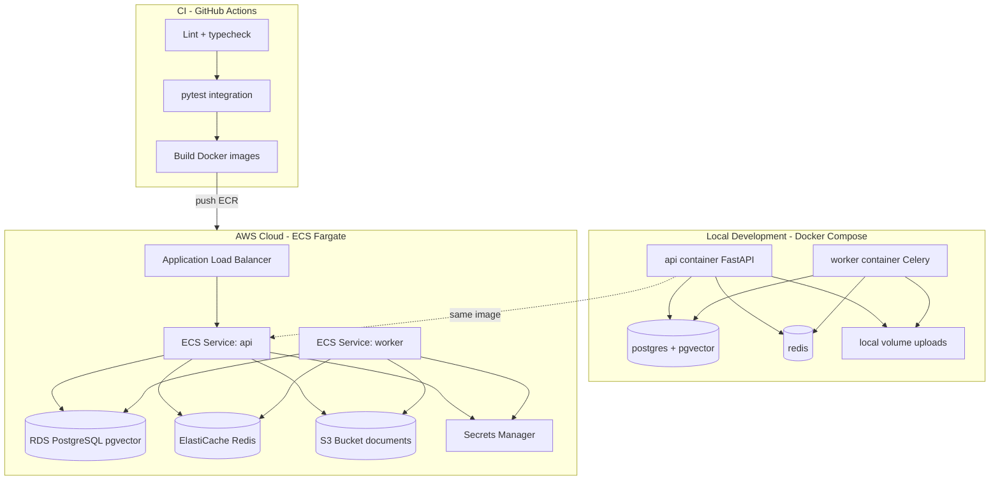

# Deployment Architecture

Deployment design for local development and cloud MVP. **Primary cloud target: AWS ECS Fargate** (see ADR-008).

## Deployment Diagram



Source: [diagrams/deployment-diagram.mmd](./diagrams/deployment-diagram.mmd)

---

## Primary Target: AWS ECS Fargate

**Justification:**
- Same Docker image for API and worker (different entrypoint) — fits ECS task definitions cleanly
- RDS PostgreSQL supports pgvector; mature ops path for portfolio demos
- S3 native for document storage
- No cluster node management (vs EKS)
- Cloud Run viable alternative; ECS chosen for tighter S3/IAM/RDS integration common in engineering portfolios

## Local Development Architecture

`docker-compose.yml` services:

| Service | Image | Ports |
|---------|-------|-------|
| `postgres` | `pgvector/pgvector:pg16` | 5432 |
| `redis` | `redis:7-alpine` | 6379 |
| `api` | Build `Dockerfile` | 8000 |
| `worker` | Same image, `celery worker` | — |
| `web` (optional) | Next.js | 3000 |

Volumes: `postgres_data`, `uploads_data`.

Commands:
- `docker compose up` — full stack
- `alembic upgrade head` — migrations via api container or init script
- `python -m scripts.seed_demo` — Northstar Cloud dataset

## Cloud Architecture

| Component | AWS Service | MVP sizing |
|-----------|-------------|------------|
| API | ECS Fargate | 0.5 vCPU, 1 GB, desired count 1 |
| Worker | ECS Fargate | 0.5 vCPU, 1 GB, desired count 1 |
| Database | RDS PostgreSQL 16 + pgvector | `db.t4g.micro` |
| Redis | ElastiCache `cache.t4g.micro` | Single node |
| Files | S3 | One bucket, versioning off |
| Secrets | Secrets Manager | JWT, DB URL, API keys |
| Load balancer | ALB | HTTPS termination |
| Images | ECR | Two tags: api, worker same digest |
| IaC | Terraform scaffold | VPC, ECS, RDS, Redis, S3, ALB modules |

## Environment Variables

| Variable | Required | Description |
|----------|----------|-------------|
| `DATABASE_URL` | Yes | PostgreSQL connection string |
| `REDIS_URL` | Yes | Redis broker URL |
| `JWT_SECRET_KEY` | Yes | HS256 secret |
| `JWT_EXPIRY_HOURS` | No | Default 24 |
| `STORAGE_BACKEND` | Yes | `local` or `s3` |
| `STORAGE_PATH` | No | Local upload directory when `STORAGE_BACKEND=local` (default `./uploads`) |
| `S3_BUCKET` | If s3 | Bucket name |
| `AWS_REGION` | If s3 | e.g. `eu-west-1` |
| `LLM_PROVIDER` | Yes | `openai` or `anthropic` |
| `OPENAI_API_KEY` | If openai | |
| `ANTHROPIC_API_KEY` | If anthropic | |
| `EMBEDDING_MODEL` | No | Default `text-embedding-3-small` |
| `CHAT_MODEL` | No | Default `gpt-4o-mini` |
| `RETRIEVAL_MIN_SCORE` | No | Default 0.72 |
| `MAX_UPLOAD_BYTES` | No | Default 20971520 |
| `LOG_LEVEL` | No | Default `INFO` |
| `ENVIRONMENT` | No | `development`, `staging`, `production` |

## Secrets

- Local: `.env` file (gitignored)
- Cloud: AWS Secrets Manager → injected as ECS task secrets
- Never bake secrets into Docker images
- IAM task role for S3 access (no static AWS keys on ECS)

## Database Migrations

- Alembic migrations in repo under `app/migrations/`
- CI runs migrations against test DB
- Deploy: run `alembic upgrade head` as one-off ECS task before rolling API update
- Rollback: `alembic downgrade -1` + previous task definition (see below)

## File Storage

| Env | Config |
|-----|--------|
| Local | `STORAGE_BACKEND=local`, volume mount |
| Cloud | `STORAGE_BACKEND=s3`, IAM role read/write |

## Queue / Cache

- Celery broker: Redis DB 0
- Result backend: disabled (use DB job status)
- ElastiCache in same VPC as ECS tasks; security group allows 6379 from ECS only

## Worker Deployment

- Separate ECS service `atlasops-worker`
- Same ECR image; command override: `celery -A app.infrastructure.celery_app worker -l info -c 2`
- Autoscaling deferred; fixed count 1 for MVP
- Scale trigger post-MVP: queue depth > 100

## CI — GitHub Actions

Pipeline on PR and main:
1. Lint (`ruff`, `mypy` optional)
2. Unit + integration tests with service containers (postgres, redis)
3. Build Docker image
4. Push to ECR on main (optional)
5. Terraform plan on PR (infra changes)

## Rollback Considerations

| Layer | Rollback |
|-------|----------|
| Application | ECS rolling deploy to previous task definition revision |
| Database | Forward-only migrations preferred; downgrade scripts for breaking changes |
| Worker | Same image tag rollback as API |
| Terraform | State-backed; revert commit + apply |

Keep migrations backward compatible for one release when possible.

## Cost-Conscious MVP Setup

Estimated monthly (single region, low traffic demo):

| Resource | ~Cost |
|----------|-------|
| ECS Fargate (2 tasks) | $30–40 |
| RDS db.t4g.micro | $15 |
| ElastiCache micro | $12 |
| S3 + ALB | $5–15 |
| **Total** | **~$60–80/mo** |

LLM usage billed separately per provider.

Local development: $0 (Docker Compose only).

## Terraform Scaffold (INFRA-006)

```text
terraform/
  modules/
    vpc/
    ecs/
    rds/
    elasticache/
    s3/
    alb/
  environments/
    dev/
      main.tf
      variables.tf
      outputs.tf
```

Outputs: ALB URL, bucket name, RDS endpoint (sensitive).

## What Runs Where

| Process | Local | Cloud |
|---------|-------|-------|
| HTTP API | api container | ECS api service |
| Celery worker | worker container | ECS worker service |
| PostgreSQL | compose | RDS |
| Redis | compose | ElastiCache |
| Migrations | manual/CI | ECS one-off task |
| Frontend | optional local | S3+CloudFront static (optional) or local demo |

## Deferred

- Multi-AZ RDS (enable for staging+)
- CDN for API
- Kubernetes
- Multi-region
- WAF (document as post-MVP hardening)
